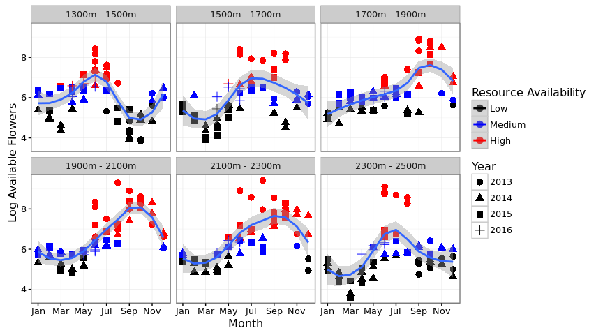
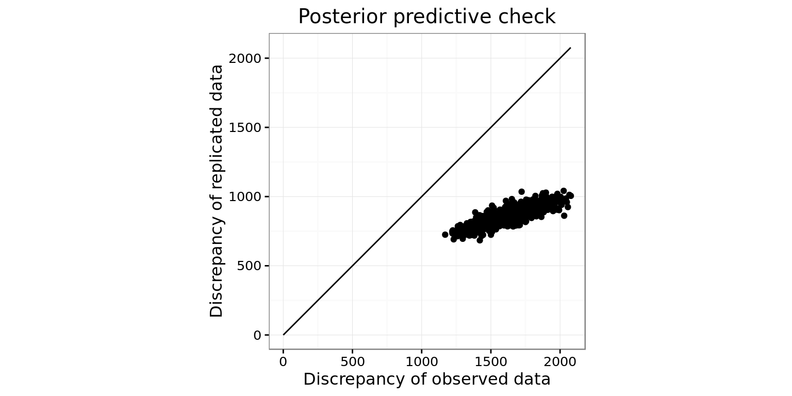

# Trait-matching and Available Resources
Ben Weinstein - Stony Brook University  


```
## [1] "Run Completed at 2016-08-08 21:17:24"
```


```r
#reload if needed
#load("Observed.RData")
```

#Load in data


```r
#read in flower morphology data, comes from Nectar.R
fl.morph<-read.csv("InputData/FlowerMorphology.csv")

#use effective corolla where possible.
fl.morph$Corolla<-fl.morph$EffectiveCorolla

fl.morph[is.na(fl.morph$Corolla),"Corolla"]<-fl.morph[is.na(fl.morph$Corolla),"TotalCorolla"]

#fuchsia macrostigma has an undue influence on this analysis, being 3x longer than other flowers, its not clear that birds really have to reach down the full corolla lenghth, use effective corolla length.
#fl.morph[fl.morph$Group.1 %in% "Fuchsia macrostigma","Corolla"]<-50

#First row is empty
fl.morph<-fl.morph[-1,]

#Bring in Hummingbird Morphology Dataset, comes from
hum.morph<-read.csv("InputData/HummingbirdMorphology.csv")

#taxonomy change, we are calling them Crowned Woodnymph's now.
hum.morph$English<-as.character(hum.morph$English)

hum.morph$English[hum.morph$English %in% "Green-crowned Woodnymph"]<-"Crowned Woodnymph"

#Bring in Interaction Matrix
int<-read.csv("InputData/HummingbirdInteractions.csv")

#one date error
int[int$DateP %in% '2013-07-25',"Month"]<-7

#one duplicate camera error, perhaps two GPS records.
int<-int[!(int$ID %in% "FH1108" & int$Date_F %in% '2014-12-01'),]
int[int$Iplant_Double %in% "Onagaraceae fuschia",]<-"Fuchsia macrostigma"

#Correct known taxonomic disagreements, atleast compared to traits
int[int$Iplant_Double=="Alloplectus purpureus","Iplant_Double"]<-"Glossoloma purpureum"
int[int$Iplant_Double=="Capanea affinis","Iplant_Double"]<-"Kohleria affinis"
int[int$Iplant_Double=="Columnea cinerea","Iplant_Double"]<-"Columnea mastersonii"
int[int$Iplant_Double=="Alloplectus teuscheri","Iplant_Double"]<-"Drymonia teuscheri"
int[int$Iplant_Double=="Drymonia collegarum","Iplant_Double"]<-"Alloplectus tetragonoides"

#Some reasonable level of presences, 25 points
keep<-names(which(table(int$Hummingbird) > 10))

int<-int[int$Hummingbird %in% keep & !int$Hummingbird %in% c("Sparkling Violetear"),]

m.dat<-droplevels(int[colnames(int) %in% c("ID","Video","Time","Hummingbird","Sex","TransectID","Transect_R","Iplant_Double","Pierce","DateP","Month","ele","Type")])

#Does the data come from camera or transect?
m.dat$Type<-(is.na(m.dat$TransectID))*1

m.dat$Year<-years(as.Date(m.dat$DateP))
#one missing date
m.dat$Year[m.dat$Year %in% 2012]<-2013
m.dat$Year[m.dat$Year %in% 2106]<-2016

#Number of bird species
h_species<-nlevels(m.dat$Hummingbird)

#Number of plant species
plant_species<-nlevels(m.dat$Iplant_Double)

#Get english name
dath<-merge(m.dat,hum.morph, by.x="Hummingbird",by.y="English",keep=all)

#Merge to flowers
int.FLlevels<-levels(factor(dath$Iplant_Double))

#Which flowers are we missing info for?
missingTraits<-int.FLlevels[!int.FLlevels %in% fl.morph$X]

#print(paste("Missing Trait Information:",missingTraits))
dath<-merge(dath,fl.morph, by.x="Iplant_Double",by.y="X")

#Drop piercing events, since they don't represent correlation
#dath<-dath[!dath$Pierce %in% c("y","Y"),]
```

##Match Species to Morphology


```r
#observed traitmatching
traitmatchF<-abs(t(sapply(hum.morph$Bill,function(x){x-fl.morph$Corolla})))
rownames(traitmatchF)<-hum.morph$English
colnames(traitmatchF)<-fl.morph$Group.1
```


```r
#match names #Round to 2 decimals #Convert to cm for winbugs, avoids numerical underflow
traitmatchT<-round(traitmatchF[rownames(traitmatchF) %in% dath$Hummingbird,colnames(traitmatchF) %in% dath$Iplant_Double],2)
traitmatchT<-traitmatchT[sort(rownames(traitmatchT)),sort(colnames(traitmatchT))]
```

##Elevation ranges

Create a binary variable whether each observation was in a low elevation or high elevation transect. We have some species that just occur at the top of the gradient, and are not present in the sampling window of flowers at the low elevation.

Accounting for non-availability.
We have to figure out which plants were sampled in which periods, and if it was sampled, the non-detection are 0 if it wasn't the non-detection are NA. then remove all the Na's.


```r
elevH<-read.csv("InputData/HummingbirdElevation.csv",row.names=1)
head(elevH)
```

```
##                 Hummingbird  Low        m   High Index
## 1    White-whiskered Hermit 1340 1396.969 1532.0     1
## 2            Andean Emerald 1378 1397.000 1380.0     1
## 3    Stripe-throated Hermit 1368 1397.324 1454.2     1
## 4 Rufous-tailed Hummingbird 1370 1430.636 1380.0     1
## 5         Crowned Woodnymph 1360 1453.625 1527.8     1
## 6  Wedge-billed Hummingbird 1331 1627.737 2006.0     3
```

```r
colnames(elevH)[5]<-"Elevation"
elevH$Bird<-1:nrow(elevH)

#high elevation or low elevation
elevP<-read.csv("InputData/PlantElevation.csv",row.names=1)
colnames(elevP)[5]<-"Elevation"
elevP$Plant<-1:nrow(elevP)
elevP$Iplant_Double<-as.character(elevP$Iplant_Double)

#Merge to observed Data
#plants
dathp<-merge(dath,elevP,by="Iplant_Double")

#birds
datph<-merge(dathp,elevH,by="Hummingbird")
```

What elevation transect is each observation in?
The camera data need to be inferred from the GPS point.


```r
#cut working best on data.frame
datph<-as.data.frame(datph)

#which elevation bin is each observation within
labs<-paste(seq(1300,2500,200),seq(1500,2700,200),sep="_")

#for the couple points that have 1290 elevation, round up to 300 for convienance
datph$ele[datph$ele < 1300]<-1301
datph$ele<-as.numeric(datph$ele)
datph$Transect_R[is.na(datph$Transect_R)]<-as.character(cut(datph[is.na(datph$Transect_R),]$ele,seq(1300,2700,200),labels=labs))

#Elev for the transects is the midpoint
tran_elev<-datph[datph$Survey_Type=='Transect',"Transect_R"]
datph[datph$Survey_Type=='Transect',"ele"]<-sapply(tran_elev,function(x){
  mean(as.numeric(str_split(x,"_")[[1]]))
})
```

### Define Time Events


```r
#ID for NA is holger transects, make the id's 1:n for each day of transect at each elevation, assuming no elevation was split across days.
datph$ID<-as.character(datph$ID)
noid<-datph[is.na(datph$ID),]

id_topaste<-paste(noid$Month,noid$Year,"Transect",sep="_")
datph[which(is.na(datph$ID)),"ID"]<-id_topaste

#Create year month combination
datph$Time<-paste(datph$Month,datph$Year,sep="_")

#Label survey type
datph$Survey_Type<-NA

mt<-!is.na(datph$TransectID)*1
datph$Survey_Type[mt==1]<-"Transect"
datph$Survey_Type[!datph$Survey_Type %in% "Transect"]<-"Camera"

datph<-datph[datph$Survey_Type=="Camera",]

#Day level
#add day ID
sdat<-split(datph,list(datph$ID),drop = T)

sdat<-lapply(sdat,function(x){
  x<-droplevels(x)
  x$Day<-as.numeric(as.factor(x$DateP))
  return(x)
})

indatraw<-rbind_all(sdat)

#Species names
for (x in 1:nrow(indatraw)){
  indatraw$Hummingbird[x]<-as.character(elevH[elevH$Bird %in% indatraw$Bird[x],"Hummingbird"])
  indatraw$Iplant_Double[x]<-as.character(elevP[elevP$Plant %in% indatraw$Plant[x],"Iplant_Double"])
}

#match the traits
traitmelt<-melt(traitmatchT)
colnames(traitmelt)<-c("Hummingbird","Iplant_Double","Traitmatch")

#dummy presence variable
indatraw$Yobs<-1

#prune columsn to make more readable
indatraw<-indatraw[,c("Hummingbird","Iplant_Double","ID","Time","Month","Year","Transect_R","ele","DateP","Yobs","Day","Survey_Type","Pierce")]
```

##Summarize daily interactions
To estimate the daily detectability, there can only be a max of one interaction per day.
We use mean elevation to average across observations within a transect

```r
indatraw<-indatraw %>% group_by(Hummingbird,Iplant_Double,ID,Day) %>% summarize(Yobs=sum(Yobs),Time=unique(Time),Transect_R=unique(Transect_R),Month=unique(Month),Year=unique(Year),ele=mean(ele),DateP=unique(DateP),Survey_Type=unique(Survey_Type)) %>% ungroup()
```


##Absences - accounting for non-detection

We have more information than just the presences, given species elevation ranges, we have absences as well. Absences are birds that occur at the elevation of the plant sample, but were not recorded feeding on the flower.


```r
#Only non-detections are real 0's, the rest are NA's and are removed.
#Plants not surveyed in that time period
#Hummingbirds not present at that elevation

#For each ID
Time<-unique(indatraw$Time)

#absences data frame
absences<-list()

for(t in Time){
  IDlist<-unlist(unique(indatraw[indatraw$Time ==t,"ID"]))

  for (j in IDlist){
  #Which plants were sampled
  a<-indatraw %>% filter(Time==t,ID==j)
  
  #For each sampled transect
  trans<-unique(a$Transect_R)
  
  if(!length(trans)==0){
    for(transect in trans){

    #for each date 
    datec<-a %>% filter(Transect_R %in% transect)
    datecam<-unique(datec$DateP)
    }} else{
      datecam<-a %>% distinct(DateP) %>% .$DateP
    }
    for(Date in datecam){
      
    #for each plant along that transect at that date
    pres<-a %>% filter(DateP %in% Date) %>% distinct(Iplant_Double) %>% .$Iplant_Double
    
    #Which day in sampling
    dday<-a %>% filter(Transect_R %in% transect,DateP %in% Date) %>% distinct(Day) %>% .$Day

      for (plant in pres){
        #Get mean elevation of that plant record
        camelev<- a %>% filter(Transect_R %in% transect,DateP %in% Date,Iplant_Double %in% plant) %>% .$ele %>% mean()
        
        #Which birds are present at that observation
        predh<-elevH[((elevH$Low < camelev) & (camelev < elevH$High)),"Hummingbird"]
        
        #remove the ones seen on that plant
        hum_present<-a %>% filter(Transect_R %in% transect,DateP %in% Date,Iplant_Double %in% plant) %>% .$Hummingbird
        abbh<-predh[!predh %in% hum_present]
        if(length(abbh)==0){next}
        
        #Make absences from those )(cat not the best)
        add_absences<-data.frame(Hummingbird=abbh,Iplant_Double=plant,Time=t,ID=j,DateP=Date,Month=min(a$Month),Year=unique(a$Year),Transect_R=transect,ele=camelev,Day=unique(dday),Survey_Type=unique(a$Survey_Type),Yobs=0)
        absences<-append(absences,list(add_absences))
      }
    }
  }
}
    
indatab<-rbind_all(absences)

#merge with original data
indat<-rbind_all(list(indatraw,indatab))
```


```r
#Get trait information
#match the traits
indat<-merge(indat,traitmelt,by=c("Hummingbird","Iplant_Double"))
```

Reformat index for jags.
Jags needs a vector of input species 1:n with no breaks.


```r
#Easiest to work with jags as numeric ordinal values
indat$Hummingbird<-as.factor(indat$Hummingbird)
indat$Iplant_Double<-as.factor(indat$Iplant_Double)
indat$jBird<-as.numeric(indat$Hummingbird)
indat$jPlant<-as.numeric(indat$Iplant_Double)

jagsIndexBird<-data.frame(Hummingbird=levels(indat$Hummingbird),jBird=1:length(levels(indat$Hummingbird)))
 
jagsIndexPlants<-data.frame(Iplant_Double=levels(indat$Iplant_Double),jPlant=1:length(levels(indat$Iplant_Double)))

#Similiarly, the trait matrix needs to reflect this indexing.
jTraitmatch<-traitmatchT[rownames(traitmatchT) %in% unique(indat$Hummingbird),colnames(traitmatchT) %in% unique(indat$Iplant_Double)]
```

#Resources at each month

In our model the covariate is indexed at the scale at which the latent count is considered fixed. This means we need the resource availability per month across the entire elevation gradient for each point.


```r
#Get flower transect data
full.fl<-read.csv("InputData/FlowerTransectClean.csv")[,-1]

#some taxonomy changes
full.fl[full.fl$Iplant_Double=="Alloplectus purpureus","Iplant_Double"]<-"Glossoloma purpureum"
full.fl[full.fl$Iplant_Double=="Capanea affinis","Iplant_Double"]<-"Kohleria affinis"
full.fl[full.fl$Iplant_Double=="Columnea cinerea","Iplant_Double"]<-"Columnea mastersonii"
full.fl[full.fl$Iplant_Double=="Alloplectus teuscheri","Iplant_Double"]<-"Drymonia teuscheri"
full.fl[full.fl$Iplant_Double=="Drymonia collegarum","Iplant_Double"]<-"Alloplectus tetragonoides"
full.fl[full.fl$Iplant_Double=="Alloplectus tenuis","Iplant_Double"]<-"Drymonia tenuis"

 #month should be capital 
colnames(full.fl)[colnames(full.fl) %in% "month"]<-"Month"

#group by month and replicate, remove date errors by making a max of 10 flowers, couple times where the gps places it in wrong transect by 1 to 2 meters. 
flower.month<-group_by(full.fl,Month,Year,Transect_R,Date_F) %>% dplyr::summarise(Flowers=sum(Total_Flowers,na.rm=TRUE))  %>% filter(Flowers>20)
  
#Make month abbreviation column, with the right order
flower.month$Month.a<-factor(month.abb[flower.month$Month],month.abb[c(1:12)])

#Make year factor column
flower.month$Year<-as.factor(flower.month$Year)

#get quantile for each transect
#thresh<-melt(group_by(flower.month) %>% summarize(Threshold=quantile(Flowers,0.5)))
flower.month$R<-cut(flower.month$Flowers,breaks=c(0,quantile(flower.month$Flowers,0.33),quantile(flower.month$Flowers,0.66),max(flower.month$Flowers)),label=c("Low","Medium","High"))

#fix the levels
flower.month$PTransect_R<-flower.month$Transect_R
levels(flower.month$PTransect_R)<-c("1300m - 1500m", "1500m - 1700m","1700m - 1900m","1900m - 2100m","2100m - 2300m","2300m - 2500m")
#plot

ggplot(flower.month,aes(x=Month.a,log(Flowers),col=R,shape=as.factor(Year))) + geom_point(size=3) + theme_bw()  + geom_smooth(aes(group=1)) + ylab("Flowers") + xlab("Month") + facet_wrap(~PTransect_R) + labs(shape="Year", y= "Log Available Flowers") + scale_x_discrete(breaks=month.abb[seq(1,12,2)]) + scale_color_manual(labels=c("Low","Medium","High"),values=c("black","blue","red")) + labs(col="Resource Availability")
```



```r
ggsave("Figures/FlowerMonth.jpeg",dpi=600,height=5,width=9)

#turn min and max elvation into seperate columns for the range
flower.month$minElev<-as.numeric(str_extract(flower.month$Transect_R,"(\\d+)"))
flower.month$maxElev<-as.numeric(str_match(flower.month$Transect_R,"(\\d+)_(\\d+)")[,3])
```


```r
indat$All_Flowers<-NA
indat$Used_Flowers<-NA
indat$FlowerA<-NA

#Resource list for each species.
slist<-int %>% group_by(Hummingbird,Iplant_Double) %>% distinct() %>% dplyr::select(Hummingbird,Iplant_Double) %>% arrange(Hummingbird)

#Create time ID for flower transects
full.fl$Time<-paste(full.fl$Month,full.fl$Year,sep="_")

#all flowers for each ID period
allF<-full.fl %>% group_by(Month,Year,Transect_R,Date_F) %>% summarize(n=sum(Total_Flowers,na.rm=T)) %>% summarize(mn=mean(n)) %>% summarize(F=sum(mn)) %>% as.data.frame()

#Individual flowers for each ID period
indF<-full.fl %>% group_by(Iplant_Double,Month,Year,Transect_R,Date_F) %>% summarize(n=sum(Total_Flowers,na.rm=T)) %>% summarize(mn=mean(n)) %>% summarize(F=sum(mn)) %>% as.data.frame()

for (x in 1:nrow(indat)){

#All flowers
 indat$All_Flowers[x]<-allF[allF$Month %in% indat$Month[x] & allF$Year %in% indat$Year[x],"F"]
 
 #filter by species used by hummingbird
 sp_list<-slist[slist$Hummingbird %in% indat$Hummingbird[x],"Iplant_Double"]

 indat$Used_Flowers[x]<-sum(indF[indF$Iplant_Double %in% sp_list$Iplant_Double & indF$Month %in% indat$Month[x] & indF$Year %in% indat$Year[x],"F"])
  
  #just the abundance of that species
  indat$FlowerA[x]<-sum(indF[indF$Iplant_Double %in% indat$Iplant_Double[x] & indF$Month %in% indat$Month[x] & indF$Year %in% indat$Year[x],"F"])

}
```

###Relationship between resource measures


```r
ggplot(indat,aes(x=All_Flowers,y=Used_Flowers)) + geom_point() + facet_wrap(~Hummingbird,scales="free")
```



##Binary Measures of Resources


```r
#All Resources
#indat$BAll_Flowers<-(indat$Month  %in% c("6","7","8","9","10"))*1

indat$BAll_Flowers<-(indat$All_Flowers > quantile(indat$All_Flowers,0.5))*1

qthresh<-indat %>% group_by(Hummingbird) %>% summarize(UThresh=quantile(Used_Flowers,0.75))

indat<-merge(indat,qthresh)
indat$BUsed_Flowers<-(indat$Used_Flowers > indat$UThresh)*1

fthresh<-indat %>% group_by(Hummingbird) %>% summarize(FThresh=mean(FlowerA))
indat<-merge(indat,fthresh)
indat$BFlowerA<-(indat$FlowerA > indat$FThresh)*1

#merge with flower month, split by elevation, mean per month
sflowers<-flower.month %>% group_by(Transect_R,Month,Year) %>% summarize(Flowers=mean(Flowers))
sflowers$R<-cut(sflowers$Flowers,breaks=c(0,quantile(sflowers$Flowers,0.33),quantile(sflowers$Flowers,0.66),max(sflowers$Flowers)),label=c("Low","Medium","High"))
 
indat<-merge(indat,sflowers,c("Transect_R","Month","Year"))
```


```r
#Combine resources with observed data
f<-(indat$Survey_Type=="Camera")*1
f[f==0]<-NA
indat$Camera<-indat$Yobs * f

f<-(indat$Survey_Type=="Transect")*1
f[f==0]<-NA
indat$Transect<-indat$Yobs * f
```


```r
indat<-droplevels(indat)

#Turn Time and ID into numeric indexes
indat$jTime<-as.numeric(as.factor(indat$Time))
indat$jID<-as.numeric(as.factor(indat$ID))

#index resources
indat$scaledR<-as.numeric(indat$R)
resourceMatrix<-indat %>% group_by(jBird,jPlant,jID) %>% summarize(v=max(scaledR))  %>% acast(jBird ~ jPlant ~ jID,value.var='v',fill=0)

##melted version for plotting
mindat<-melt(indat,measure.vars=c("Camera","Transect"))
```

##View species identity in resource splits.


```r
#Count of species in both time sets
splist<-mindat %>% filter(value>0) %>% group_by(Hummingbird,Resource= BUsed_Flowers) %>% distinct(Iplant_Double) %>% dplyr::select(Iplant_Double)

#relevel text
splist$Resource<-factor(as.factor(as.character(splist$Resource)),labels = c("Low","High"))

splist<-split(splist,splist$Hummingbird)
p<-list()
for (x in 1:length(splist)){
  split_sp<-split(splist[[x]]$Iplant_Double,splist[[x]]$Resource)
  p[[x]]<-venn.diagram(split_sp,filename=NULL,scaled=T,main =unique(splist[[x]]$Hummingbird),fill=c("Blue","Red"),alpha=c(.25,.75),cat.cex=1.5,cex=.75,main.cex=2)

  #get index
  labs<-lapply(p[[x]],function(i) i$label)
  
  in_low<-which(labs == "Low")

  in_high<-which(labs == "High")

#edit labels, depends on length
#which is low
  if(length(p[[x]])==10){
  p[[x]][[in_low-3]]$label<-paste(split_sp$Low[!split_sp$Low %in% split_sp$High],collapse="\n")

  p[[x]][[in_high-3]]$label<-paste(split_sp$High[!split_sp$High %in% split_sp$Low],collapse="\n")
  }
  
  if(length(p[[x]])==9 & !is.null(labs[[4]])){
      p[[x]][[in_low-3]]$label<-paste(split_sp$Low[!split_sp$Low %in% split_sp$High],collapse="\n")

  p[[x]][[in_high-1]]$label<-paste(split_sp$High[!split_sp$High %in% split_sp$Low],collapse="\n")
  }
  if(length(p[[x]])==9 & is.null(labs[[4]])){
      p[[x]][[in_low-2]]$label<-paste(split_sp$Low[!split_sp$Low %in% split_sp$High],collapse="\n")

  p[[x]][[in_high-2]]$label<-paste(split_sp$High[!split_sp$High %in% split_sp$Low],collapse="\n")
  }
  grid.newpage()
  grid.draw(p[[x]])
}

#venn diagram writes a silly set of log files
file.remove(list.files(pattern="*.log"))
```


```r
gc()
```

```
##           used (Mb) gc trigger  (Mb) max used  (Mb)
## Ncells 1651513 88.3    2637877 140.9  2637877 140.9
## Vcells 3967469 30.3    6946061  53.0  5721718  43.7
```

```r
save.image("Observed.RData")
```

