# Trait-matching and Resources Simulation
Ben Weinstein  
3/11/2016  


#Rationale

In the paper we suggest a model of species interactons based on trait values. An alterantive, or complimentary, mechanism may be that the frequency at which a hummingbird i interacts with a flower j is shaped by the abundance of flower j at time k.   

The key change from eq1 in the main analysis is:

$$log(\lambda_{i,j,k})<-\alpha_i + \beta_i * |Bill_i - Corolla_j| * \beta_2 * Abundances_{j,k} + \beta_3 * Resources_{j,k} * |Bill_i - Corolla_j| $$

In this extension, the interpretation of $β_1$ would be the effect of bill matching on the frequency of interactions, $β_2$ the influence of increasing abundance of resources on the frequency of interactions, and β_3 the interaction effect between resources and abundance. For example, a negative interaction effect would mean that as resources become more common, birds use flowers that are less similar to their bill lengths. This result would suggest the importance of choosing a matched resource is less important when encounter rates are high (Robinson & Wilson 1998). In contrast, a positive interaction effect would mean that hummingbirds choose highly matched resources as they become more abundant. This result would suggest niche partitioning to exclude potential competitors based on morphological diversity (Correa & Winemiller 2014). 

##Caveats

There are a number of challenging questions that would need to be answered from a methodological perspective to implement with empirical data.

1. N-mixture models depend on a closed state. Given that phenology of flowers may not match the timing of camera events, what is the temporal overlap required? Collecting the data to define the abundance of flower j at time k is the key question. Once we can agree on a metric, incorporating it into the model is more straightforward. 

2. Is it the abundance of the flower being filmed that structures the frequency of interactions? Or is it the relative abundance to other food sources? Whose other food sources? All species? Just the abundance of resources used by that species based on the dataset?

3. It seems reasonable that abundance measure need to be spatially limited. From how far away should we include abundance information? Presumably this would be based on the foraging pattern of each hummingbird species (perhaps using RFID or other data telemetry data). This information doesn’t yet exist (but see (Hadley & Betts 2009)). 

#Simulation   

## Parameters

* 3 hummingbird species
* Range of hummingbird bill sizes (mm) ~ Poisson(2)
* 10 plants
* Range of corolla sizes (mm) ~ Poisson(2)
* Mean frequent ($\lambda$) for each hummingbird is drawn from U(0,10)  
* Trait matching (minimizing Bill-Corolla difference) is drawn from a 
hierarchical distribution

$$log(\lambda_{i,j,k})<-\alpha_i + \beta_i * |Bill_i - Corolla_j| * \beta_2 * Abundances_{j,k} + \beta_3 * Resources_{j,k} * |Bill_i - Corolla_j| $$

* 24 month replicates
* Flower availability is log normally distribution (mu=20)


```r
#function that can be used to test different parameters
sim<-function(gamma1,gamma2,gamma3){

#Number of hummingbird species
h_species=3
plant_species=20
months=30
detection=runif(h_species,0,1)
phenology=1

#Bill sizes
Bill<-rpois(h_species,10)

#Corolla sizes
Corolla<-rpois(plant_species,15)

#Subtract both and take absolute value
traitmatch<-abs(sapply(Corolla,function(x) x - Bill)/10)

#fill out for each month
traitarray<-array(NA,dim=c(h_species,plant_species,months))
#fill for each month
for (x in 1:months){
  traitarray[,,x]<-traitmatch 
}

#simulate some poisson distributed resource counts for each replicate
#this will be same for each species to start with.
resources<-array(NA,dim=c(h_species,plant_species,months))

#fill for each month
for (x in 1:months){
  for (y in 1:plant_species){
   resources[,y,x]<-rpois(1,10)   
  }
}

#standardize predictors

resources<-array(data=scale(resources),dim=c(h_species,plant_species,months))
#traitarray<-array(data=scale(traitarray),dim=c(h_species,plant_species,months))

#regression slope for trait-matching and resources
#trait match
#gamma=-0.5
intercept<-2
sigma_slope1<- 0.1
sigma_intercept<- 0.1

#resources
#gamma2=0
sigma_slope2<- 0.1

#resources * traitmatch
#gamma3=0
sigma_slope3<- 0.1

#loop through each species and plants

#draw values from hierarcichal distributions
beta1<-rnorm(h_species,gamma1,sigma_slope1)
beta2<-rnorm(h_species,gamma2,sigma_slope2)
beta3<-rnorm(h_species,gamma3,sigma_slope3)

alpha<-rnorm(h_species,intercept,sigma_intercept)

#fit regression
lambda<-exp(alpha + beta1 * traitarray + beta2 * resources + beta3 * resources * traitarray)

true_interactions<-array(data=sapply(lambda,function(x){rpois(1,lambda=x)}),dim=c(h_species,plant_species,months))

#combine and melt into a single datafFrame
mdat<-dcast(melt(list(y=true_interactions,traitmatch=traitarray,resources=resources)),Var1+Var2+Var3~L1)
return(mdat)}
```

#Patterns and Inference

We can image five important biological scenerios.

* Model 1: Increased resources have no effect on visitation
* Model 2: Increased resources have positive effect on visitation
* Model 3: Increased resources have negative effect on visitation
* Model 4: As resources increase, hummingbirds interact **more** with plants that match their bill length. 
* Model 5: As resources increase, hummingbirds interact **less** with plants that match their bill length. 

For each of these scenerios, let's simulate some data to view what the model would look like. We first do this before accounting for detection bias to get a clear idea of the mechanisms involved. Adding the detection model is equivalent regardless of the underlying process model.

## Species interactions are based solely on trait matching. No effect of resources and no interaction effect.


```r
mdat<-sim(-.5,0,0)
ggplot(mdat,aes(col=resources,y=y,x=traitmatch)) + geom_point() + geom_smooth(aes(group=1),method="glm",method.args = list(family = "poisson")) + theme_bw() + labs(x="Bill-Corolla Difference",y="Visits","Hummingbird") + ggtitle("Simulated data for each species") + labs(col="Flower Abundance") + scale_color_continuous(low="blue",high="red") + facet_wrap(~Var1,nrow=1)
```

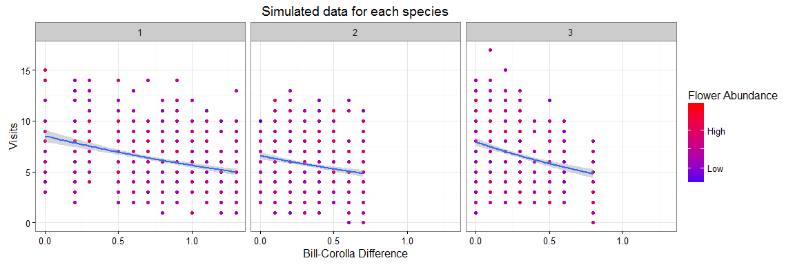

## Species interactions are based on similarity in morphology and abundance of resources, without an interaction. As resources increase, species interact more with all resources. Red points on top, blue on the bottom.


```r
mdat<-sim(-0.5,0.5,0)
ggplot(mdat,aes(col=resources,y=y,x=traitmatch)) + geom_point() + geom_smooth(aes(group=1),method="glm",method.args = list(family = "poisson"),formula=y~x) + theme_bw() + labs(x="Bill-Corolla Difference",y="Visits","Hummingbird") + ggtitle("Simulated data for each species") + labs(col="Flower Abundance") + scale_color_continuous(low="blue",high="red") + facet_wrap(~Var1,nrow=1)
```

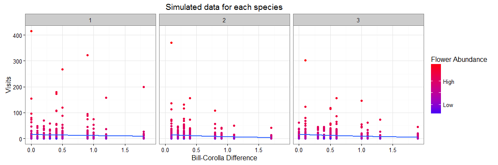

## Species interactions are based on similarity in morphology and abundance of resources, without an interaction. As resources decrease, species interact more with all resources. Blue on top, red on the bottom.


```r
mdat<-sim(-0.5,-0.5,0)
ggplot(mdat,aes(col=resources,y=y,x=traitmatch)) + geom_point() + geom_smooth(aes(group=1),method="glm",method.args = list(family = "poisson"),formula=y~x) + theme_bw() + labs(x="Bill-Corolla Difference",y="Visits","Hummingbird") + ggtitle("Simulated data for each species") + labs(col="Flower Abundance") + scale_color_continuous(low="blue",high="red") + facet_wrap(~Var1,nrow=1)
```

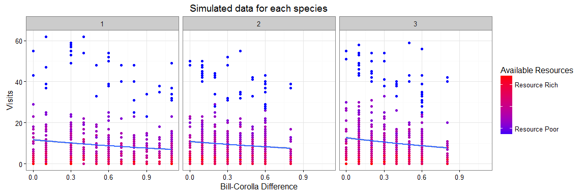

## Species interactions are based on similarity in morphology and abundance of resources, with an interaction. As resources increase, hummingbirds interact **more** with plants that match their bill length.


```r
mdat<-sim(-0.5,0,-0.5)
ggplot(mdat,aes(col=resources,y=y,x=traitmatch)) + geom_point() + geom_smooth(aes(group=1),method="glm",method.args = list(family = "poisson"),formula=y~x) + theme_bw() + labs(x="Bill-Corolla Difference",y="Visits","Hummingbird") + ggtitle("Simulated data for each species") + labs(col="Flower Abundance") + scale_color_continuous(low="blue",high="red") + facet_wrap(~Var1,nrow=1)
```


## Species interactions are based on similarity in morphology and abundance of resources, with an interaction. As resources increase, hummingbirds interact **less** with plants that match their bill length.


```r
mdat<-sim(-.5,0,0.5)
ggplot(mdat,aes(col=resources,y=y,x=traitmatch)) + geom_point() + geom_smooth(aes(group=1),method="glm",method.args = list(family = "poisson"),formula=y~x) + theme_bw() + labs(x="Bill-Corolla Difference",y="Visits","Hummingbird") + ggtitle("Correlation in Simulated Data") + labs(col="Flower Abundance") + scale_color_continuous(low="blue",high="red") + facet_wrap(~Var1,nrow=1)
```

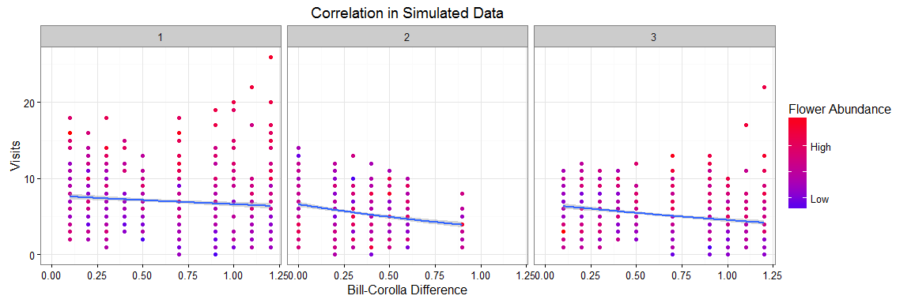

Let's look at that estimate for each of the cases we just outlined.


```r
sim1<-sim(.5,0,0)
sim2<-sim(.5,1,0)
sim3<-sim(.5,-1,0)
sim4<-sim(.5,0,-1)
sim5<-sim(.5,0,1)
sims<-list(sim1,sim2,sim3,sim4,sim5)
names(sims)<-as.character(1:5)

s<-melt(sims,id.vars=colnames(sim1))
modlist<-list()
for (x in 1:length(sims)){
mod<-glm(data=sims[[x]],y~resources*traitmatch,family = "poisson")
cond<-mod$coefficients[3] + mod$coefficients[4] * mod$data$traitmatch
d<-data.frame(R_effect=cond,traitmatch=mod$data$traitmatch,model=x)
modlist[[x]]<-d
}
modlist<-rbind_all(modlist)
ggplot(modlist,aes(x=traitmatch,y=R_effect,col=as.factor(model))) + geom_line() + labs(col="Model",x="Difference in Bill and Corolla Length",y="Effect of resources on trait-matching") + geom_point() + theme_bw()
```

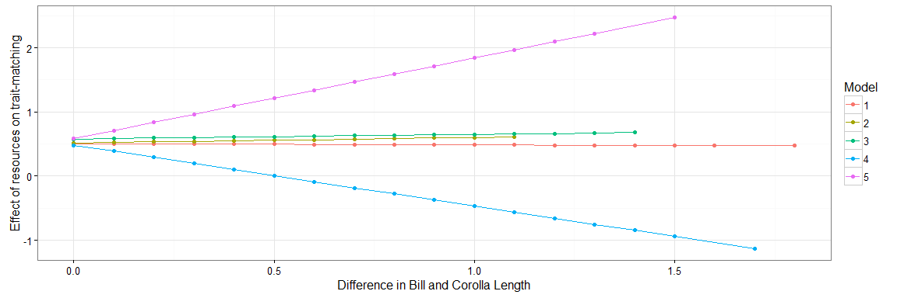

* Model 1: Increased resources has no effect on trait-matching
* Model 2: Increased resources has positive effect on visitation
* Model 3: Increased resources has negative effect on visitation
* Model 4: As resources increase, hummingbirds interact **more** with plants that match their bill length. 
* Model 5: As resources increase, hummingbirds interact **less** with plants that match their bill length. 


#Incorporate incomplete detection

Let's simulate Model 5 and add in unequal detection rates for each species.


```r
##Simulate Interactions
h_species=3
plant_species=10
months=24
phenology=1

#Bill sizes
Bill<-rpois(h_species,10)

#Corolla sizes
Corolla<-rpois(plant_species,15)

#Subtract both and take absolute value
traitmatch<-abs(sapply(Corolla,function(x) x - Bill)/10)

#fill out for each month
traitarray<-array(NA,dim=c(h_species,plant_species,months))
#fill for each month
for (x in 1:months){
  traitarray[,,x]<-traitmatch 
}

#simulate some poisson distributed resource counts for each replicate
#this will be same for each species to start with.
resources<-array(NA,dim=c(h_species,plant_species,months))

#fill for each month
for (x in 1:months){
  for (y in 1:plant_species){
   resources[,y,x]<-rpois(1,10)   
  }}

#standardize predictors

resources<-array(data=scale(resources),dim=c(h_species,plant_species,months))
#traitarray<-array(data=scale(traitarray),dim=c(h_species,plant_species,months))

#regression slope for trait-matching and resources
#trait match
gamma1=0.5
intercept<-.5
sigma_slope1<- 0.1
sigma_intercept<- 0.1

#resources
gamma2=0
sigma_slope2<- 0.1

#resources * traitmatch
gamma3=0.5
sigma_slope3<- 0.1

#draw values from hierarcichal distributions
beta1<-rnorm(h_species,gamma1,sigma_slope1)
beta2<-rnorm(h_species,gamma2,sigma_slope2)
beta3<-rnorm(h_species,gamma3,sigma_slope3)

alpha<-rnorm(h_species,intercept,sigma_intercept)

#fit regression
lambda<-exp(alpha + beta1 * traitarray + beta2 * resources + beta3 * resources * traitarray)

true_interactions<-array(data=sapply(lambda,function(x){rpois(1,x)}),dim=c(h_species,plant_species,months))

#combine and melt into a single datafFrame
mdat<-dcast(melt(list(y=true_interactions,traitmatch=traitarray,resources=resources)),Var1+Var2+Var3~L1)

ggplot(mdat,aes(col=resources,y=y,x=traitmatch)) + geom_point() + geom_smooth(aes(group=1),method="glm",method.args = list(family = "poisson"),formula=y~x) + theme_bw() + labs(x="Bill-Corolla Difference",y="Visits","Hummingbird") + ggtitle("Correlation in Simulated Data") + labs(col="Flower Abundance") + scale_color_continuous(low="blue",high="red")
```

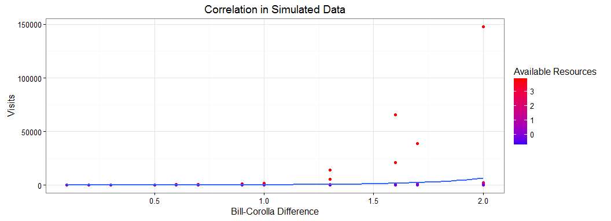

## Create biased detection rates


```r
#For each species loop through and create a replicate dataframe
obs<-array(dim=c(h_species,plant_species,months))

detection= runif(h_species,0,1)

#Which months are plants in bloom?
#This is the phenology matrix
sampled<-replicate(plant_species,rbinom(months,1,phenology))
sampled[sampled==0]<-NA

for(x in 1:h_species){
  for (y in 1:plant_species){
    
    #True State
    ts<-true_interactions[x,y,]
    
    #detections and phenology
    obs[x,y,]<-ts *sampled[,y]
    }
  }

#plot observed state
obs.state<-melt(obs)
colnames(obs.state)<-c("Hummingbird","Plant","Month","Detections")

#turn NA's to 0
#obs.state$Detections[is.na(obs.state$Detections)]<-0

obs.state$Hummingbird<-as.factor(obs.state$Hummingbird)
obs.state$Plant<-factor(obs.state$Plant,levels=1:plant_species)

### True Interaction Matrix

colnames(mdat)<-c("Hummingbird","Plant","Month","resources","traitmatch","y")
month1<-mdat[mdat$Month==1,]
trueplot<-ggplot(month1,aes(y=as.factor(Plant),x=as.factor(Hummingbird),fill=y)) + geom_tile() + labs(x="Hummingbird",y="Plant",fill="Presence") +  scale_fill_continuous(low="white",high="black","Visits")
trueplot + ggtitle("Example Matrix: Month 1")
```

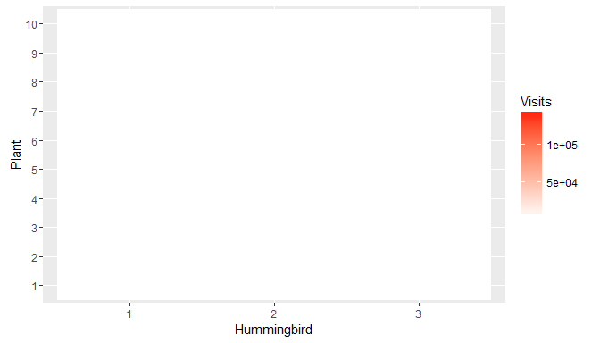


### Model Fitting

$$ Y_{i,j,k} \sim Pois(\lambda_{i,j,k}) $$

$$log(\lambda_{i,j,k})<-\alpha_i + \beta_i * abs(Bill_i - Corolla_j) * \beta_2 * Resources_k + \beta_3 * Resources_k * abs(Bill_i - Corolla_j) $$

**Priors**

$$\alpha_i \sim N(intercept,\tau_{\alpha})$$
$$\beta_{1,i} \sim N(\gamma_1i,\tau_{\beta_1})$$
$$\beta_{2,i} \sim N(\gamma_2i,\tau_{\beta_2})$$
$$\beta_{3,i} \sim N(\gamma_3i,\tau_{\beta_3})$$

**Hyperpriors**

Group Level Means

$$\gamma_{1,i} \sim N(0.001,0.001)$$
$$\gamma_{2,i} \sim N(0.001,0.001)$$
$$\gamma_{3,i} \sim N(0.001,0.001)$$
$$ intercept \sim N(0.001,0.001)$$

Group Level Variance

$$\tau_{\alpha} \sim Gamma(0.001,0.001)$$
$$\tau_\beta1 \sim Gamma(0.001,0.001)$$
$$\tau_\beta2 \sim Gamma(0.001,0.001)$$
$$\tau_\beta3 \sim Gamma(0.001,0.001)$$

**Derived quantities**

$$\sigma_{int} = \frac{1}{\tau_{\alpha}}^2$$
$$\sigma_{slope1} = \frac{1}{\tau_{\beta_1}}^2$$
$$\sigma_{slope2} = \frac{1}{\tau_{\beta_2}}^2$$
$$\sigma_{slope3} = \frac{1}{\tau_{\beta_3}}^2$$

#Hierarcichal Bayesian Model


```r
#Source model
source("Bayesian/Poisson.R")

#print model
writeLines(readLines("Bayesian/Poisson.R"))
```

```
## 
## sink("Bayesian/Poisson.jags")
## 
## cat("
##     model {
##     for (i in 1:Birds){
##     for (j in 1:Plants){
##     for (k in 1:Months){
##     
##     # True state model for the only partially observed true state    
##     log(lambda[i,j,k])<- alpha[i] + beta1[i] * traitmatch[i,j,k] + beta2[i] * resources[i,j,k] + beta3[i] * resources[i,j,k] * traitmatch[i,j,k]
##     Y[i,j,k] ~ dpois(lambda[i,j,k])
##     }
##     }
##     }
##     
##     for (i in 1:Birds){
##     alpha[i] ~ dnorm(intercept,tau_alpha)
##     beta1[i] ~ dnorm(gamma1,tau_beta1)    
##     beta2[i] ~ dnorm(gamma2,tau_beta2)    
##     beta3[i] ~ dnorm(gamma3,tau_beta3)    
##     }
##     
##     #Hyperpriors
##     #Slope grouping
##     gamma1~dnorm(0.001,0.001)
##     gamma2~dnorm(0.001,0.001)
##     gamma3~dnorm(0.001,0.001)
##     
##     #Intercept grouping
##     intercept~dnorm(0.001,0.001)
##     
##     # Group variance
##     tau_alpha ~ dgamma(0.0001,0.0001)
##     sigma_int<-pow(1/tau_alpha,0.5) #Derived Quantity
##     
##     #Slope
##     tau_beta1 ~ dgamma(0.0001,0.0001)
##     tau_beta2 ~ dgamma(0.0001,0.0001)
##     tau_beta3 ~ dgamma(0.0001,0.0001)
##     
##     sigma_slope1<-pow(1/tau_beta1,0.5)
##     sigma_slope2<-pow(1/tau_beta2,0.5)
##     sigma_slope3<-pow(1/tau_beta3,0.5)
##     
##     }
##     ",fill=TRUE)
## 
## sink()
```

```r
#Input Data
Dat <- list(
  Y=obs,
  Birds=dim(obs)[1],
  Plants=dim(obs)[2],
  Months=dim(obs)[3],
  resources=resources,
  traitmatch=traitarray)

#A blank Y matrix - all present
initY<-array(dim=c(Dat$Birds,Dat$Plants,Dat$Months),data=max(obs,na.rm=T))
initB<-as.numeric(matrix(nrow=h_species,ncol=1,data=.1))

#Inits
InitStage <- function(){list(beta1=initB,beta2=initB,beta3=initB,alpha=rep(.5,Dat$Birds),intercept=0,tau_alpha=0.1,tau_beta1=0.1,tau_beta2=0.1,tau_beta3=0.1,gamma1=0,gamma2=0,gamma3=0)}

#Parameters to track
ParsStage <- c("alpha","beta1","beta2","beta3","intercept","sigma_int","sigma_slope1","sigma_slope2","sigma_slope3","gamma1","gamma2","gamma3")

#MCMC options

ni <- 50000  # number of draws from the posterior
nt <- max(c(1,ni*.0001))  #thinning rate
nb <- ni*.95 # number to discard for burn-in
nc <- 2  # number of chains

#Jags

m = jags(inits=InitStage,
         n.chains=nc,
         model.file="Bayesian/Poisson.jags",
         working.directory=getwd(),
         data=Dat,
         parameters.to.save=ParsStage,
         n.thin=nt,
         n.iter=ni,
         n.burnin=nb,
         DIC=T)
```

```
## Compiling model graph
##    Resolving undeclared variables
##    Allocating nodes
## Graph information:
##    Observed stochastic nodes: 720
##    Unobserved stochastic nodes: 20
##    Total graph size: 3033
## 
## Initializing model
```


```r
pars<-extract_par(m)
```

##Assess Convergence


```r
###Chains
ggplot(pars[pars$par %in% c("alpha","beta1","beta2","beta3"),],aes(x=Draw,y=estimate,col=as.factor(Chain))) + geom_line() + facet_grid(par~species,scale="free") + theme_bw() + labs(col="Chain") + ggtitle("Detection Probability")
```

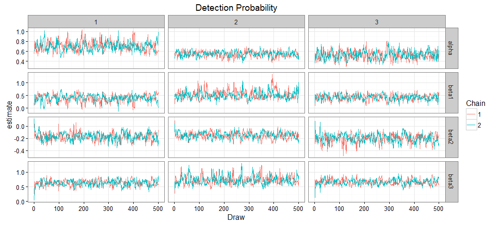


```r
ggplot(pars[pars$par %in% c("gamma1","gamma2","gamma3","sigma_int","sigma_slope1","sigma_slope2","sigma_slope3"),],aes(x=Draw,y=estimate,col=as.factor(Chain))) + geom_line() + theme_bw() + labs(col="Chain") + ggtitle("Trait-matching regression") + facet_wrap(~par,scales="free")
```

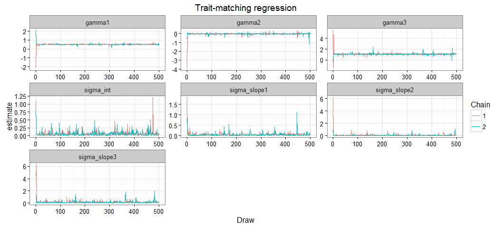

##Posteriors


```r
###Posterior Distributions
p<-ggplot(pars[pars$par %in% c("alpha","beta1","beta2","beta3"),],aes(x=estimate)) + geom_histogram() + ggtitle("Estimate of parameters") + facet_grid(species~par,scales="free") + theme_bw() + ggtitle("Species Posteriors")

#Add true values
tr<-melt(data.frame(species=1:h_species,alpha=alpha,beta1=beta1,beta2=beta2,beta3=beta3),id.var='species')
colnames(tr)<-c("species","par","value")
psim<-p + geom_vline(data=tr,aes(xintercept=value),col='red',linetype='dashed',size=1)
#ggsave("Figures/SimulationPosteriors.jpg",dpi=300,height=8,width=8)
```


```r
p<-ggplot(pars[pars$par %in% c("gamma1","gamma2","gamma3","intercept","sigma_int","sigma_slope1","sigma_slope2","sigma_slope3"),],aes(x=estimate)) + geom_histogram() + ggtitle("Hierarchical Posteriors") + facet_wrap(~par,scale="free",nrow=2) + theme_bw() 

#Add true values
tr<-melt(list(gamma1=gamma1,gamma2=gamma2,gamma3=gamma3,intercept=intercept,sigma_int=sigma_intercept,sigma_slope1=sigma_slope1,sigma_slope2=sigma_slope2,sigma_slope3=sigma_slope3))

colnames(tr)<-c("value","par")

psim2<-p + geom_vline(data=tr,aes(xintercept=value),linetype='dashed',size=1,col="red")
#ggsave("Figures/SimulationH.jpg",dpi=300,height=4,width=10)
grid.arrange(psim,psim2,heights=c(.6,.4))
```

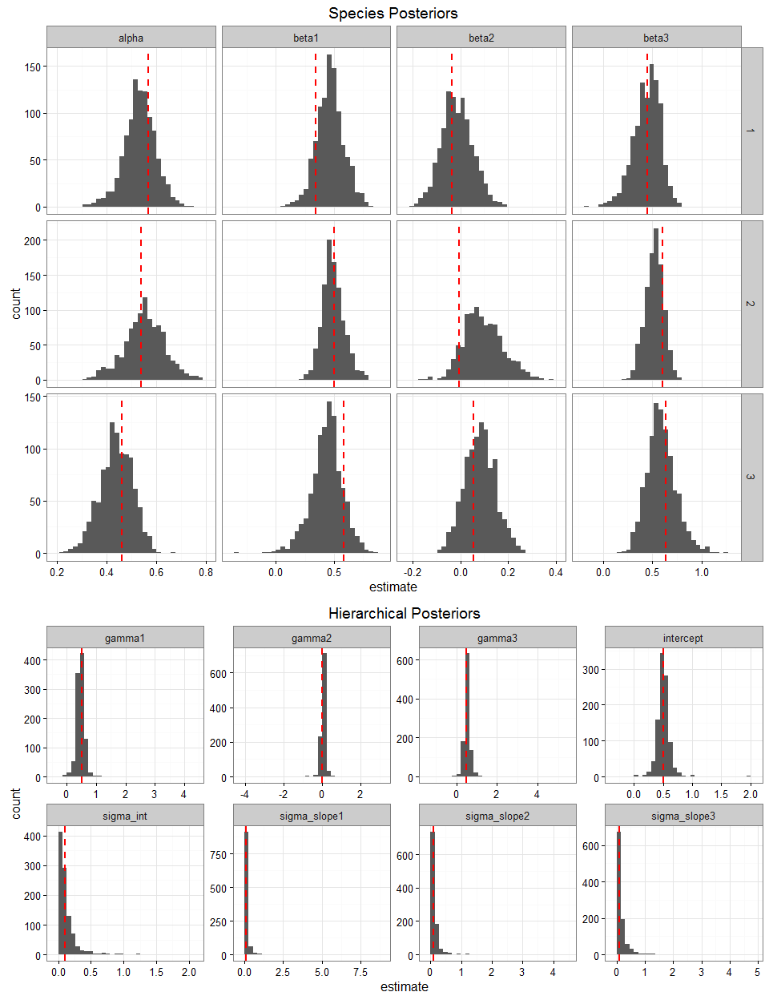

****
<span style="color:red; font-size=25" >True values are the red dashed lines</span>

##Predicted Relationship 


```r
castdf<-dcast(pars[pars$par %in% c("gamma1","gamma2","gamma3","intercept"),], Chain + Draw~par,value.var="estimate")

trajF<-function(alpha,beta1,beta2,beta3,x,resources){
  indat<-data.frame(alpha,beta1,beta2,beta3)
  
  #fit regression for each input estimate
  sampletraj<-list()
  
  for (y in 1:nrow(indat)){
    v=exp(indat$alpha[y] + indat$beta1[y] * x + indat$beta2[y] * resources + indat$beta3[y] * x*resources)
    
    sampletraj[[y]]<-data.frame(x=as.numeric(x),y=as.numeric(v))
  }
  
  sample_all<-rbind_all(sampletraj)
  
  #Compute CI intervals
  predy<-group_by(sample_all,x) %>% summarise(lower=quantile(y,0.025,na.rm=T),upper=quantile(y,0.975,na.rm=T),mean=mean(y,na.rm=T))
}

#calculate interactions

intF<-function(alpha,beta1,beta2,beta3,x,resources){
  indat<-data.frame(alpha,beta1,beta2,beta3)
  
  #fit regression for each input estimate
  sampletraj<-list()
  
  for (y in 1:nrow(indat)){
    v=indat$beta2[y] + indat$beta3[y]  * x
    sampletraj[[y]]<-data.frame(x=as.numeric(x),y=as.numeric(v))
  }
  
  sample_all<-rbind_all(sampletraj)
  
  #Compute CI intervals
  predy<-group_by(sample_all,x) %>% summarise(lower=quantile(y,0.025,na.rm=T),upper=quantile(y,0.975,na.rm=T),mean=mean(y,na.rm=T))
}
```

## Calculated predicted visitation rates


```r
predy<-trajF(alpha=castdf$intercept,beta1=castdf$gamma1,x=as.numeric(traitarray),resources=resources,beta2=castdf$gamma2,beta3=gamma3)

orig<-trajF(alpha=rnorm(2000,intercept,sigma_intercept),beta1=rnorm(2000,gamma1,sigma_slope1),beta2=rnorm(2000,gamma2,sigma_slope2),beta3=rnorm(2000,gamma3,sigma_slope3),x=as.numeric(traitarray),resources=resources)

#plot and compare to original data
psim3<-ggplot(data=predy,aes(x=x)) + geom_ribbon(aes(ymin=lower,ymax=upper),alpha=0.1,fill="red")  + geom_line(aes(y=mean),size=.8,col="red",linetype="dashed") + theme_bw() + ylab("Interactions") + geom_line(data=orig,aes(x=x,y=mean),col='black',size=1)+ xlab("Difference between Bill and Corolla Length") + geom_point(data=mdat,aes(x=traitmatch,y=y))

psim3
```

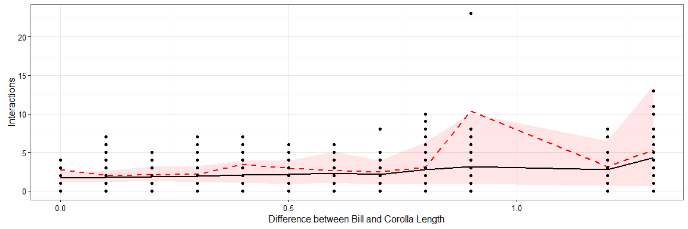

```r
#ggsave("Figures/SimulationResults.jpg",height=5,width=6,dpi=300)
```


##Visualize interactions


```r
predyint<-intF(alpha=castdf$intercept,beta1=castdf$gamma1,x=as.numeric(traitarray),resources=resources,beta2=castdf$gamma2,beta3=gamma3)

origint<-intF(alpha=rnorm(2000,intercept,sigma_intercept),beta1=rnorm(2000,gamma1,sigma_slope1),beta2=rnorm(2000,gamma2,sigma_slope2),beta3=rnorm(2000,gamma3,sigma_slope3),x=as.numeric(traitarray),resources=resources)

#plot and compare to original data
psim4<-ggplot(data=predyint,aes(x=x)) + geom_ribbon(aes(ymin=lower,ymax=upper),alpha=0.3,fill="red") + theme_bw() + ylab("Interactions") + geom_line(data=origint,aes(x=x,y=mean),col='black',size=1) + geom_line(aes(y=mean),size=.8,col="red",linetype="dashed") + xlab("Difference between Bill and Corolla Length") 

psim4
```

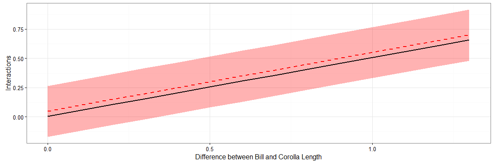

