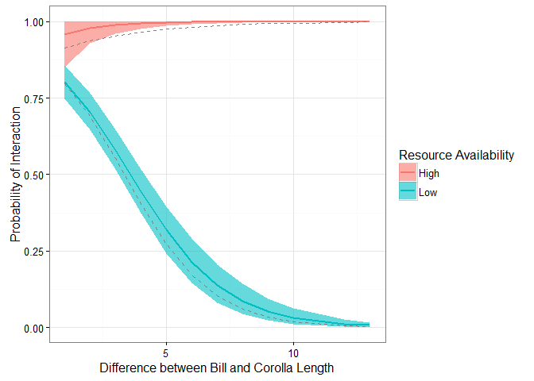

# Simulated Data for Two Detection Methods for Observing Species Interactions
Ben Weinstein  
December 25, 2015  

#Summary


```r
#load("Simulation_2M.RData")
```

There is some underlying network of interactions between hummingbird species  i and plant species j. We observe these interactions using transects across elevation ranges and cameras at individual flowers. To combine these data to jointly estimate the importance of trait-matching and resources on interaction intensity we need a hierarchical occupancy model that accounts for 1) the difference in sampling effort between survey types, 2) The variable number of replicates per species, 3) The difference in detectability of interactions based on survey type. The occupancy model below uses months as our estimated latent state. There are two surveys per month, and a variable number of cameras for each flower, often with no cameras on a given flower in a month.

# True Simulated values

Hummingbird Species =5

Plant Species=6

Survey Periods = 50

Detection Probability for Camera = 0.25

Detection Probability for Transect = 0.6

Hummingbird species are connected by the following hyperpriors

* intercept<-1

* alpha_sigma<- 0.2

Effect of Trait-matching

* gamma1=-0.5

* sigma_slope1<- 0.2

Effect of Resources

* gamma2=0

* sigma_slope2<- 0.1

Interaction effect of resources * traitmatch

* gamma3=0.3

* sigma_slope3<- 0.1

Bill sizes
Bill<-rpois(h_species,10)

Corolla sizes

Corolla<-rpois(plant_species,15)

Resources are scored as either 'High' or 'Low' and is modeled as rbinom(n=1,size=1,prob=0.5)


```r
h_species=5
plant_species=6
Times=24
detection_cam=0.25
detection_trans=0.6

#Bill sizes
Bill<-rpois(h_species,10)

#Corolla sizes
Corolla<-rpois(plant_species,15)

#Subtract both and take absolute value
traitmatch<-abs(sapply(Corolla,function(x) x - Bill))

#fill out for each month
traitarray<-array(NA,dim=c(h_species,plant_species,Times))
#fill for each month
for (x in 1:Times){
  traitarray[,,x]<-traitmatch 
}

#simulate some poisson distributed resource counts for each replicate
#this will be same for each species to start with.
resources<-array(NA,dim=c(h_species,plant_species,Times))

#fill for each month
for (x in 1:Times){
  resources[,,x]<-rbinom(1,1,0.25)  
}

#standardize predictors
#resources<-array(data=scale(resources,center=TRUE,scale=TRUE),dim=c(h_species,plant_species,Times))

#regression slope for trait-matching and resources

#Intercept
alpha_mu<-2
alpha_sigma<- 0.05

#trait match
beta1_mu=-0.5
beta1_sigma<- 0.05

#resources
beta2_mu=0
beta2_sigma<- 0.05

#Interaction
beta3_mu=0.75
beta3_sigma<- 0.05

#loop through each species and plants

#draw values from hierarcichal distributions
beta1<-rnorm(h_species,beta1_mu,beta1_sigma)
beta2<-rnorm(h_species,beta2_mu, beta2_sigma)
beta3<-rnorm(h_species,beta3_mu, beta3_sigma)
alpha<-rnorm(h_species,alpha_mu,alpha_sigma)

phi<-inv.logit(alpha + beta1 * traitarray + beta2*resources+beta3*traitarray*resources)

#How many cameras for each flower during each time period?
true_interactions<-array(data=sapply(phi,function(x){rbinom(1,1,prob=x)}),dim=c(h_species,plant_species,Times))

#combine and melt into a single datafFrame
mdat<-dcast(melt(list(y=true_interactions,traitmatch=traitarray,resources=resources)),Var1+Var2+Var3~L1)
colnames(mdat)<-c("Bird","Plant","Time","resources","traitmatch","True_state")

##Observation models
dat<-list()
for (x in 1:nrow(mdat)){
  #for each bird plant combo in that time period
    timedat<-mdat[x,]
    #Transects
    Y_Transect=rbinom(3,timedat$True_state,prob=detection_trans)
    out<-data.frame(Bird=timedat$Bird,Plant=timedat$Plant,Time=timedat$Time,Y_Transect)
    
    #Cameras
    cams<-rpois(1,1)
    if(!cams==0){
    Y_Camera=rbinom(cams,mdat$True_state[x],prob=detection_cam)
    out<-rbind_all(list(out,data.frame(Bird=timedat$Bird,Plant=timedat$Plant,Time=timedat$Time,Y_Camera)))
    }
    
    dat[[x]]<-out
  }

odat<-rbind_all(dat)

mdat<-merge(mdat,odat,by=c("Bird","Plant","Time"))
#ARRANGE
mdat <- mdat %>% arrange(Bird,Plant,Time)
```

# Observed Data


```r
mdatm<-melt(mdat,measure.vars = c("True_state","Y_Camera","Y_Transect"))

#label resource times
mdatm$resources<-as.factor(mdatm$resources)
levels(mdatm$resources)<-c("Low","High")
ggplot(mdatm,aes(x=traitmatch,y=value,col=variable)) + geom_point(alpha=.5) + geom_smooth(method="glm",method.args=list(family="binomial"),linetype="dashed",size=1.1) + ggtitle("Correlation in Simulated Data") + labs(x="Difference in Bill and Corolla Length (mm)",y="Probability of Interactions",col="Observation Process") + theme_bw() + facet_wrap(~resources)
```

<!-- -->

```r
#traitmatch dataframe
Traitmatch<-mdat %>% group_by(Bird,Plant) %>% summarize(v=unique(traitmatch)) %>% acast(Bird~Plant,value.var="v")
TimeResources<-mdat %>% group_by(Bird,Time,Plant) %>% summarize(v=unique(resources)) %>% acast(Bird~Plant~Time,value.var="v",fill=0)

#label survey type
mdat$Survey_Type<-NA
mdat$Survey_Type<-is.na(mdat$Y_Transect)
mdat$Survey_Type<-as.factor(mdat$Survey_Type)
levels(mdat$Survey_Type)<-c("Transect","Camera")
```

#Hierarchical Occupancy Model

For hummingbird species i feeding on plant species j observed at time k and sampling event d. 

Observation Model

Transects

$$ Y_{Transect_{i,j,k,d}} \sim Bernoulli(S_{i,j,k} * \omega_{Transect})$$
$$ \omega_{Transect} <- \phi_{Transect}* EffortTransect_k $$

Cameras

$$ Y_{Camera_{i,j,k,d}} \sim Binomial(S_{i,j,k} * \omega_{Camera})$$
$$ \omega_{Camera} <- \phi_{Camera} * EffortCamera_k $$

Process Model

$$ S_{i,j,k} \sim Binomial(\rho_{i,j,k}) $$
$$ logit(\rho_{i,j,k}) = \alpha_i + \beta_{1,i} * Traitmatch_{i,j} + \beta_{2,i} *Resources_{j,k} $$


**Priors**

$$ \phi_{Camera} \sim Uniform(0,1) $$
$$ \phi_{Transect} \sim Uniform(0,1) $$
$$\alpha_i \sim Normal(\mu_\alpha,\tau_{\alpha})$$
$$\beta_{1,i} \sim Normal(\mu_{\beta_1},\tau_{\beta_1})$$
$$\beta_{2,i} \sim Normal(\mu_{\beta_2},\tau_{\beta_2})$$

**Hyperpriors**

Group Level Means

$$\mu_{\beta_1} \sim Normal(0,1.67)$$
$$\mu_{\beta_2} \sim Normal(0,1.67)$$
$$ \mu_{\alpha} \sim Normal(0,1.67)$$

Group Level Variance

$$\tau_{\alpha} \sim Uniform(0,100)$$
$$\tau_{\beta_1} \sim Uniform(0,100)$$
$$\tau_{\beta_2} \sim Uniform(0,100)$$

# Analysis of observed data


```r
#Source model
source("Bayesian/NmixturePoissonRagged2m.R")

#print model
writeLines(readLines("Bayesian/NmixturePoissonRagged2m.R"))
```

```
## 
## sink("Bayesian/NmixturePoissonRagged2m.jags")
## 
## cat("
##     model {
##     #Compute true state for each pair of birds and plants
##     for (i in 1:Birds){
##     for (j in 1:Plants){
##     for (k in 1:Times){
##     
##     #Process Model
##     logit(rho[i,j,k])<-alpha[i] + beta1[i] * Traitmatch[i,j] + beta2[i] * resources[i,j,k] + beta3[i] * resources[i,j,k] * Traitmatch[i,j]
##     
##     #True State
##     S[i,j,k] ~ dbern(rho[i,j,k])
##     }
##     }
##     }
##     
##     #Observation Model
##     for (x in 1:Nobs){
##     
##     #Observation Process for cameras
##     detect_cam[x]<-dcam * cam_surveys[x]
## 
##     #Observation Process for transects
##     detect_transect[x]<-dtrans * trans_surveys[x]
## 
##     Yobs_camera[x] ~ dbern(detect_cam[x] * S[Bird[x],Plant[x],Time[x]])    
##     Yobs_transect[x] ~ dbern(detect_transect[x] * S[Bird[x],Plant[x],Time[x]])    
## 
##     #Assess Model Fit - Posterior predictive check
## 
##     #Fit discrepancy statistics
##     #eval[x]<-detect[Bird[x]]*S[Bird[x],Plant[x],Camera[x]]
##     #E[x]<-pow((Yobs[x]-eval[x]),2)/(eval[x]+0.5)
##     
##     #ynew[x]~dbin(detect[Bird[x]],S[Bird[x],Plant[x],Camera[x]])
##     #E.new[x]<-pow((ynew[x]-eval[x]),2)/(eval[x]+0.5)
##     
##     }
## 
##     #Priors
##     #Observation model
##     #Detect priors, logit transformed - Following lunn 2012 p85
##     
##     #For Cameras
##     dcam ~ dunif(0,1)
## 
##     #For Transects
##     dtrans ~ dunif(0,1)
##     
##     #Detection group prior
##     #dprior_cam ~ dnorm(0,0.386)
##     #dprior_trans ~ dnorm(0,0.386)
##     
##     #Group effect detect camera
##     #tau_dcam ~ dunif(0,10)
##     #sigma_dcam<-pow(1/tau_dcam,.5)
##     
##     #Group effect detect camera
##     #tau_dtrans ~ dunif(0,100)
##     #sigma_dtrans<-pow(1/tau_dtrans,.5)
## 
##     #Process Model
##     #Species level priors
##     for (i in 1:Birds){
##       
##       #Intercept
##       #logit prior, then transform for plotting
##       alpha[i] ~ dnorm(alpha_mu,alpha_tau)
## 
##       #Traits slope 
##       beta1[i] ~ dnorm(beta1_mu,beta1_tau)    
## 
##       #Plant slope
##       beta2[i] ~ dnorm(beta2_mu,beta2_tau)    
##       
##       #Interaction slope
##       beta3[i] ~ dnorm(beta3_mu,beta3_tau)    
##     }
## 
##     #Group process priors
## 
##     #Intercept 
##     alpha_mu ~ dnorm(0,0.386)
##     alpha_tau ~ dunif(0,1000)
##     alpha_sigma<-pow(1/alpha_tau,0.5) 
##     
##     #Trait
##     beta1_mu~dnorm(0,0.386)
##     beta1_tau ~ dunif(0,1000)
##     beta1_sigma<-pow(1/beta1_tau,0.5)
##     
##     #Resources
##     beta2_mu~dnorm(0,0.386)
##     beta2_tau ~ dunif(0,1000)
##     beta2_sigma<-pow(1/beta2_tau,0.5)
## 
##     #Interaction
##     beta3_mu~dnorm(0,0.386)
##     beta3_tau ~ dunif(0,1000)
##     beta3_sigma<-pow(1/beta3_tau,0.5)
## 
## }
##     ",fill=TRUE)
## 
## sink()
```

```r
#Input Data
Dat <- c('Yobs_camera','Yobs_transect','Birds','Bird','Plant','Time','Plants','Times','resources','Nobs','cam_surveys','trans_surveys','Traitmatch')

#Inits
InitStage <- function(){
  #A blank Y matrix - all present
  initY<-array(dim=c(Birds,Plants,Times),data=1)
  list(S=initY)}

#Parameters to track
ParsStage <- c("alpha","beta1","beta2","beta3","alpha_mu","alpha_sigma","beta1_mu","beta1_sigma","beta2_mu","beta2_sigma","beta3_mu","beta3_sigma","dtrans","dcam")

#MCMC options

ni <- 10000  # number of draws from the posterior
nt <- max(c(1,ni*.00001))  #thinning rate
nb <- ni*.92 # number to discard for burn-in
nc <- 2  # number of chains

#Jags

  Yobs_camera = mdat$Y_Camera
  Yobs_transect = mdat$Y_Transect
  Birds=max(mdat$Bird)
  Bird=mdat$Bird
  Plant=mdat$Plant
  Time=mdat$Time
  Plants=max(mdat$Plant)
  Times=max(mdat$Time)
  resources=TimeResources
  Nobs=nrow(mdat)
  cam_surveys=(mdat$Survey_Type=="Camera")*1
  trans_surveys=(mdat$Survey_Type=="Transect")*1
  Traitmatch=Traitmatch

  system.time(m<-do.call(jags.parallel,list(Dat,InitStage,ParsStage,model.file="Bayesian/NmixturePoissonRagged2m.jags",n.thin=nt, n.iter=ni,n.burnin=nb,n.chains=nc)))
```

```
##    user  system elapsed 
##    0.16    0.03  138.29
```


```r
pars<-extract_par(m)
```

###Assess Convergence


```r
###Chains
ggplot(pars[pars$par %in% c("alpha","beta1","beta2","beta3"),],aes(x=Draw,y=estimate,col=as.factor(Chain))) + geom_line() + facet_grid(par~species,scale="free") + theme_bw() + labs(col="Chain") + ggtitle("Species Level Probability")
```

<!-- -->


```r
ggplot(pars[pars$par %in% c("dcam","dtrans"),],aes(x=Draw,y=estimate,col=as.factor(Chain))) + geom_line() + facet_grid(~par,scale="free") + theme_bw() + labs(col="Chain") + ggtitle("Detection Probability")
```

<!-- -->


```r
ggplot(pars[pars$par %in% c("alpha_mu","alpha_sigma","beta1_mu","beta2_mu","beta3_mu","beta1_sigma","beta2_sigma","beta3_sigma"),],aes(x=Draw,y=estimate,col=as.factor(Chain))) + geom_line() + theme_bw() + labs(col="Chain") + ggtitle("Group Level Regression") + facet_wrap(~par,scales="free")
```

<!-- -->

###Posteriors


```r
###Posterior Distributions
p<-ggplot(pars[pars$par %in% c("alpha","beta1","beta2","beta3"),],aes(x=estimate)) + geom_histogram() + ggtitle("Estimate of parameters") + facet_grid(species~par,scales="free") + theme_bw() + ggtitle("Species Posteriors")

#Add true values
tr<-melt(data.frame(species=1:h_species,alpha=alpha,beta1=beta1,beta2=beta2,beta3=beta3),id.var='species')
colnames(tr)<-c("species","par","value")
psim<-p + geom_vline(data=tr,aes(xintercept=value),col='red',linetype='dashed',size=1)
#ggsave("Figures/SimulationPosteriors.jpg",dpi=300,height=8,width=8)
```


```r
p<-ggplot(pars[pars$par %in% c("beta1_mu","beta2_mu","beta3_mu","alpha_mu","alpha_sigma","beta1_sigma","beta2_sigma","beta3_sigma","dcam","dtrans"),],aes(x=estimate)) + geom_histogram() + ggtitle("Hierarchical Posteriors") + facet_wrap(~par,scale="free",nrow=2) + theme_bw() 

#Add true values
tr<-melt(list(beta1_mu=beta1_mu,beta3_mu=beta3_mu,beta2_mu=beta2_mu,alpha_mu=alpha_mu,alpha_sigma=alpha_sigma,beta1_sigma=beta1_sigma,beta3_sigma=beta3_sigma,beta2_sigma=beta2_sigma,dtrans=detection_trans,dcam=detection_cam))

colnames(tr)<-c("value","par")

psim2<-p + geom_vline(data=tr,aes(xintercept=value),linetype='dashed',size=1,col="red")
#ggsave("Figures/SimulationH.jpg",dpi=300,height=4,width=10)
```

<!-- -->

###Predicted Relationship 


```r
castdf<-dcast(pars[pars$par %in% c("beta1_mu","beta2_mu","beta3_mu","alpha_mu"),], Chain + Draw~par,value.var="estimate")

trajF<-function(alpha,beta1,beta2,beta3,x,resources){
  indat<-data.frame(alpha,beta1,beta2,beta3)
  
  #fit regression for each input estimate
  sampletraj<-list()
  
  for (y in 1:nrow(indat)){
    v=inv.logit(indat$alpha[y] + indat$beta1[y] * x + indat$beta2[y] * resources + indat$beta3[y] * x * resources)
    
    sampletraj[[y]]<-data.frame(x=as.numeric(x),y=as.numeric(v))
  }
  
  sample_all<-rbind_all(sampletraj)
  
  #Compute CI intervals
  predy<-group_by(sample_all,x) %>% summarise(lower=quantile(y,0.025,na.rm=T),upper=quantile(y,0.975,na.rm=T),mean=mean(y,na.rm=T))
}
```

#Predicted Relationship


```r
predy<-trajF(alpha=castdf$alpha_mu,beta1=castdf$beta1_mu,beta2=castdf$beta2_mu,beta3=castdf$beta3_mu,x=as.numeric(traitarray),resources = as.numeric(TimeResources))

orig<-trajF(alpha=rnorm(2000,alpha_mu,alpha_sigma),beta1=rnorm(2000,beta1_mu,beta1_sigma),beta2=rnorm(2000,beta2_mu,beta2_sigma),beta3=rnorm(2000,beta3_mu,beta3_sigma),x=as.numeric(traitarray),resources = as.numeric(TimeResources))

#plot and compare to original data
ggplot(data=predy,aes(x=x)) + geom_point(data=mdat,aes(x=traitmatch,y=True_state),alpha=.5,size=.5)+ geom_ribbon(aes(ymin=lower,ymax=upper),alpha=0.3,fill="red")  + geom_line(aes(y=mean),size=.8,col="red",linetype="dashed") + theme_bw() + ylab("Probability of interactions") + geom_line(data=orig,aes(x=x,y=mean),col='black',size=1)+ xlab("Difference between Bill and Corolla Length") + geom_line(data=orig,aes(x=x,y=upper),col='grey50',linetype='dashed',size=0.5) + geom_line(data=orig,aes(x=x,y=lower),col='grey50',linetype='dashed',size=0.5)
```

<!-- -->

##With Interaction


```r
predH<-trajF(alpha=castdf$alpha_mu,beta1=castdf$beta1_mu,x=mdat[mdat$resources==1,"traitmatch"],resources=mdat[mdat$resources==1,"resources"],beta2=castdf$beta2_mu,beta3=castdf$beta3_mu)

predL<-trajF(alpha=castdf$alpha_mu,beta1=castdf$beta1_mu,x=mdat[mdat$resources==0,"traitmatch"],resources=mdat[mdat$resources==0,"resources"],beta2=castdf$beta2_mu,beta3=castdf$beta3_mu)

predhl<-melt(list(High=predH,Low=predL),id.vars=colnames(predH))

colnames(predhl)[5]<-"BFlowerL"

mdat$BFlowerL<-factor(as.character(mdat$resources))
levels(mdat$BFlowerL)<-c("Low","High")

orig<-trajF(alpha=rnorm(2000,alpha_mu,alpha_sigma),beta1=rnorm(2000,beta1_mu,beta1_sigma),beta2=rnorm(2000,beta2_mu,beta2_sigma),beta3=rnorm(2000,beta3_mu,beta3_sigma),x=as.numeric(traitarray),resources = as.numeric(TimeResources))

ggplot(data=predhl,aes(x=x)) + geom_ribbon(aes(ymin=lower,ymax=upper,fill=BFlowerL),alpha=0.6)  + geom_line(aes(y=mean,col=BFlowerL),size=.8) + theme_bw() + ylab("Probability of Interaction") + xlab("Difference between Bill and Corolla Length") + labs(fill="Resource Availability",col="Resource Availability") + geom_line(data=orig,aes(x=x,y=upper),col='grey50',linetype='dashed',size=0.5) + geom_line(data=orig,aes(x=x,y=lower),col='grey50',linetype='dashed',size=0.5)
```

<!-- -->

The true data is plotted overtop the simulation relationship in black, and the predicted relationship in dashed red with pink CI intervals.


```r
save.image("Simulation_2M.RData")
```
