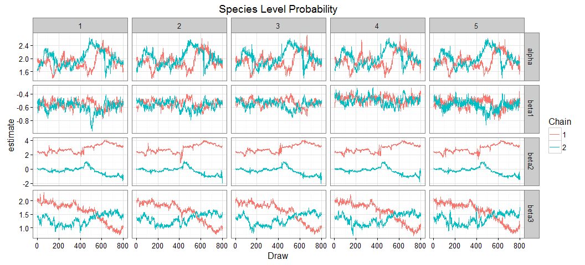
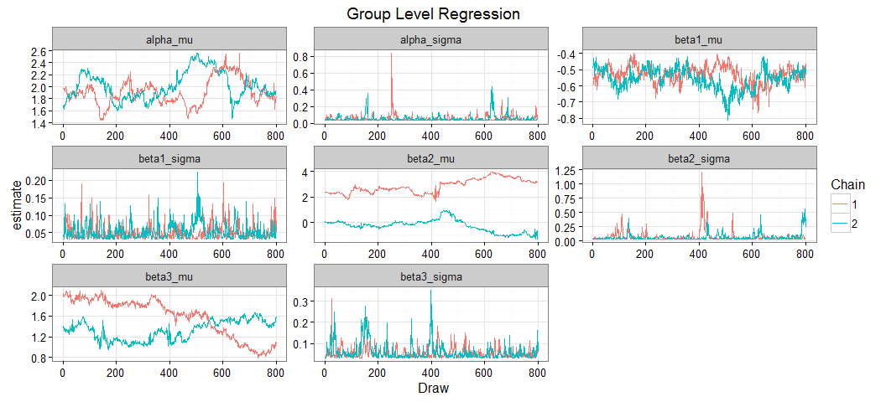

# Simulated Data for Two Detection Methods for Observing Species Interactions
Ben Weinstein  
December 25, 2015  

#Summary


```r
#load("Simulation_2M.RData")
```

There is some underlying network of interactions between hummingbird species  i and plant species j. We observe these interactions using transects across elevation ranges and cameras at individual flowers. To combine these data to jointly estimate the importance of trait-matching and resources on interaction intensity we need a hierarchical occupancy model that accounts for 1) the difference in sampling effort between survey types, 2) The variable number of replicates per species, 3) The difference in detectability of interactions based on survey type. The occupancy model below uses months as our estimated latent state. There are two surveys per month, and a variable number of cameras for each flower, often with no cameras on a given flower in a month.

# True Simulated values

Hummingbird Species =5

Plant Species=6

Survey Periods = 24

Detection Probability for Camera = 0.25

Detection Probability for Transect = 0.6


Group Intercept

* intercept<-2.5

* sigma_intercept<- 0.1

Effect of Trait-matching

* gamma1=-5

* sigma_slope1<- 0.1

Effect of Resources

* gamma2=-2

* sigma_slope2<- 0.1

Interaction effect of resources * traitmatch

* gamma3=0.3

* sigma_slope3<- 0.1

Bill sizes
Bill<-rpois(h_species,10)

Corolla sizes

Corolla<-rpois(plant_species,15)


Survey periods are 70% cameras, 30% Transect
Transects have two replicates.Cameras have variable number of replicates, modeled as rpois(lambda=0.5).

Resources are scored as either 'High' or 'Low' and is modeled as rbinom(n=1,size=1,prob=0.5)


```r
h_species=5
plant_species=6
Times=24
detection_cam=0.25
detection_trans=0.6

#which records are camera, which are transects?
mt<-rbinom(Times,1,0.7)
mt[which(mt==1)]<-"Camera"
mt[!mt=="Camera"]<-"Transect"

#Bill sizes
Bill<-rpois(h_species,10)

#Corolla sizes
Corolla<-rpois(plant_species,15)

#Subtract both and take absolute value
traitmatch<-abs(sapply(Corolla,function(x) x - Bill)/10)

#fill out for each month
traitarray<-array(NA,dim=c(h_species,plant_species,Times))
#fill for each month
for (x in 1:Times){
  traitarray[,,x]<-traitmatch 
}

#simulate some poisson distributed resource counts for each replicate
#this will be same for each species to start with.
resources<-array(NA,dim=c(h_species,plant_species,Times))

#fill for each month
for (x in 1:Times){
  resources[,,x]<-rbinom(1,1,0.5)  
}

#standardize predictors
resources<-array(data=scale(resources),dim=c(h_species,plant_species,Times))

#regression slope for trait-matching and resources
#trait match
gamma1=-5
intercept<-2.5
sigma_slope1<- 0.1
sigma_intercept<- 0.1

#resources
gamma2=0
sigma_slope2<- 0.1

#loop through each species and plants

#draw values from hierarcichal distributions
beta1<-rnorm(h_species,gamma1,sigma_slope1)
beta2<-rnorm(h_species,gamma2,sigma_slope2)

alpha<-rnorm(h_species,intercept,sigma_intercept)

phi<-inv.logit(alpha + beta1 * traitarray + beta2 * resources)

#How many cameras for each flower during each time period?
true_interactions<-array(data=sapply(phi,function(x){rbinom(1,1,prob=x)}),dim=c(h_species,plant_species,Times))

#combine and melt into a single datafFrame
mdat<-dcast(melt(list(y=true_interactions,traitmatch=traitarray,resources=resources)),Var1+Var2+Var3~L1)

colnames(mdat)<-c("Bird","Plant","Time","resources","traitmatch","True_state")

#Merge the survey type
mdat<-merge(mdat,data.frame(Time=1:Times,Survey_Type=mt))

##Observation models
dat<-list()
  
for (x in 1:nrow(mdat)){
  if(mdat$Survey_Type[x]=="Transect"){
    df<-data.frame(Y_Transect=rbinom(2,mdat$True_state[x],prob=detection_trans))
    dat[[x]]<-cbind(mdat[x,],df)
  } else{
        cams<-rpois(1,0.4)
        if(cams==0){next}
        df<-data.frame(Y_Camera=rbinom(cams,mdat$True_state[x],prob=detection_cam))
        dat[[x]]<-cbind(mdat[x,],df)
  }
}

mdat<-rbind_all(dat)
```

# Observed Data


```r
mdatm<-melt(mdat,measure.vars = c("True_state","Y_Camera","Y_Transect"))

ggplot(mdatm,aes(x=traitmatch,y=value,col=variable)) + geom_point(alpha=.5) + geom_smooth(method="glm",method.args=list(family="binomial"),linetype="dashed",size=1.1) + ggtitle("Correlation in Simulated Data") + labs(x="Difference in Bill and Corolla Length",y="Probability of Interactions",col="Observation Process") + theme_bw()
```


```r
#traitmatch dataframe
Traitmatch<-mdat %>% group_by(Bird,Plant) %>% summarize(v=unique(traitmatch)) %>% acast(Bird~Plant,value.var="v")

TimeResources<-mdat %>% group_by(Time,Plant) %>% summarize(v=unique(resources)) %>% acast(Plant~Time,value.var="v",fill=0)
```

#Hierarchical Occupancy Model

For hummingbird species i feeding on plant species j observed at time k and sampling event d. 

Observation Model

Transects

$$ Y_{Transect_{i,j,k,d}} \sim Bernoulli(S_{i,j,k} * \omega_{Transect})$$
$$ \omega_{Transect} <- \phi_{Transect}* EffortTransect_k $$

Cameras

$$ Y_{Camera_{i,j,k,d}} \sim Binomial(S_{i,j,k} * \omega_{Camera})$$
$$ \omega_{Camera} <- \phi_{Camera} * EffortCamera_k $$

Process Model

$$ S_{i,j,k} \sim Binomial(\rho_{i,j,k}) $$
$$ logit(\rho_{i,j,k}) = \alpha_i + \beta_{1,i} * Traitmatch_{i,j} + \beta_{2,i} *Resources_{j,k} $$


**Priors**

$$ \phi_{Camera} \sim Uniform(0,1) $$
$$ \phi_{Transect} \sim Uniform(0,1) $$
$$\alpha_i \sim Normal(\mu_\alpha,\tau_{\alpha})$$
$$\beta_{1,i} \sim Normal(\mu_{\beta_1},\tau_{\beta_1})$$
$$\beta_{2,i} \sim Normal(\mu_{\beta_2},\tau_{\beta_2})$$

**Hyperpriors**

Group Level Means

$$\mu_{\beta_1} \sim Normal(0,0.0001)$$
$$\mu_{\beta_2} \sim Normal(0,0.0001)$$
$$ \mu_{\alpha} \sim Normal(0,0.0001)$$

Group Level Variance

$$\tau_{\alpha} \sim Gamma(0.0001,0.0001)$$
$$\tau_{\beta_1} \sim Gamma(0.0001,0.0001)$$
$$\tau_{\beta_2} \sim Gamma(0.0001,0.0001)$$

**Derived quantities**

$$\sigma_{\alpha} = \sqrt[2]{\frac{1}{\tau_\alpha}}$$
$$\sigma_{\beta_1} = \sqrt[2]{\frac{1}{\tau_{\beta_1}}}$$
$$\sigma_{\beta_2} = \sqrt[2]{\frac{1}{\tau_{\beta_2}}}$$

# Analysis of observed data


```r
paralleljags<-T

if(paralleljags){
    
#Source model
source("Bayesian/NmixturePoissonRagged2m.R")

#print model
writeLines(readLines("Bayesian/NmixturePoissonRagged2m.R"))

#Input Data
Dat <- c('Yobs_camera','Yobs_transect','Birds','Bird','Plant','Time','Plants','Times','resources','Nobs','cam_surveys','trans_surveys','Traitmatch')

#Inits
InitStage <- function(){
  #A blank Y matrix - all present
  initY<-array(dim=c(Birds,Plants,Times),data=1)
  initB<-as.numeric(matrix(nrow=Birds,ncol=1,data=.1))

list(beta1=initB,beta2=initB,alpha=rep(.5,Birds),intercept=0,tau_alpha=0.1,tau_beta1=0.1,tau_beta2=0.1,gamma1=0,gamma2=0,S=initY)}

#Parameters to track
ParsStage <- c("alpha","beta1","beta2","intercept","sigma_alpha","sigma_slope1","sigma_slope2","gamma1","gamma2","dtrans","dcam")

#MCMC options

ni <- 2000  # number of draws from the posterior
nt <- max(c(1,ni*.0001))  #thinning rate
nb <- ni*.85 # number to discard for burn-in
nc <- 2  # number of chains

#Jags

  Yobs_camera = mdat$Y_Camera
  Yobs_transect = mdat$Y_Transect
  Birds=max(mdat$Bird)
  Bird=mdat$Bird
  Plant=mdat$Plant
  Time=mdat$Time
  Plants=max(mdat$Plant)
  Times=max(mdat$Time)
  resources=TimeResources
  Nobs=nrow(mdat)
  cam_surveys=(mdat$Survey_Type=="Camera")*1
  trans_surveys=(mdat$Survey_Type=="Transect")*1
  Traitmatch=Traitmatch

  m<-do.call(jags.parallel,list(Dat,InitStage,ParsStage,model.file="Bayesian/NmixturePoissonRagged2m.jags",n.thin=nt, n.iter=ni,n.burnin=nb,n.chains=nc))
  
} else {
  
#Source model
source("Bayesian/NmixturePoissonRagged2m.R")

#print model
writeLines(readLines("Bayesian/NmixturePoissonRagged2m.R"))

#Input Data
Dat <- list(
  Yobs_camera = mdat$Y_Camera,
  Yobs_transect = mdat$Y_Transect,
  Birds=max(mdat$Bird),
  Bird=mdat$Bird,
  Plant=mdat$Plant,
  Time=mdat$Time,
  Plants=max(mdat$Plant),
  Times=max(mdat$Time),
  resources=TimeResources,
  Nobs=nrow(mdat),
  cam_surveys=(mdat$Y_Camera>0)*1,
  trans_surveys=(mdat$Y_Transect>0)*1,
  Traitmatch=Traitmatch)

#A blank Y matrix - all present
initY<-array(dim=c(Dat$Birds,Dat$Plants,Dat$Times),data=max(mdat$Y_Transect,na.rm=T))
initB<-as.numeric(matrix(nrow=h_species,ncol=1,data=.1))

#Inits
InitStage <- function(){list(beta1=initB,beta2=initB,beta3=initB,alpha=rep(.5,Dat$Birds),intercept=0,tau_alpha=0.1,tau_beta1=0.1,tau_beta2=0.1,tau_beta3=0.1,gamma1=0,gamma2=0,gamma3=0,dtrans=0.5,dcam=0.5,N=initY)}

#Parameters to track
ParsStage <- c("alpha","beta1","beta2","intercept","sigma_alpha","sigma_slope1","sigma_slope2","gamma1","gamma2","dtrans","dcam")

#MCMC options

ni <- 2000  # number of draws from the posterior
nt <- max(c(1,ni*.0001))  #thinning rate
nb <- ni*.90 # number to discard for burn-in
nc <- 2  # number of chains

#Jags

m = jags(inits=InitStage,
         n.chains=nc,
         model.file="Bayesian/NmixturePoissonRagged2m.jags",
         working.directory=getwd(),
         data=Dat,
         parameters.to.save=ParsStage,
         n.thin=nt,
         n.iter=ni,
         n.burnin=nb,
         DIC=T)
}
```

```
## 
## sink("Bayesian/NmixturePoissonRagged2m.jags")
## 
## cat("
##     model {
##     #Compute intensity for each pair of birds and plants
##     for (i in 1:Birds){
##     for (j in 1:Plants){
##     for (k in 1:Times){
##     
##     #Process Model
##     logit(rho[i,j,k])<-alpha[i] + beta1[i] * Traitmatch[i,j] + beta2[i] * resources[j,k]
##     
##     #True number of interactions
##     S[i,j,k] ~ dbern(rho[i,j,k])
##     }
##     }
##     }
## 
##     #Observed counts for each day of sampling
##     for (x in 1:Nobs){
##     
##     #Observation Process for cameras
##     detect_cam[x]<-dcam[Bird[x]] * cam_surveys[x]
## 
##     #Observation Process for transects
##     detect_transect[x]<-dtrans[Bird[x]] * trans_surveys[x]
## 
##     Yobs_camera[x] ~ dbin(detect_cam[x],S[Bird[x],Plant[x],Time[x]])    
##     Yobs_transect[x] ~ dbin(detect_transect[x],S[Bird[x],Plant[x],Time[x]])    
## 
##     #Assess Model Fit
## 
##     #Fit discrepancy statistics
##     #eval[x]<-detect[Bird[x]]*S[Bird[x],Plant[x],Camera[x]]
##     #E[x]<-pow((Yobs[x]-eval[x]),2)/(eval[x]+0.5)
##     
##     #ynew[x]~dbin(detect[Bird[x]],S[Bird[x],Plant[x],Camera[x]])
##     #E.new[x]<-pow((ynew[x]-eval[x]),2)/(eval[x]+0.5)
##     
##     }
## 
##     #Species level priors
##     
##     for (i in 1:Birds){
##     #Detect priors, logit transformed
## 
##     #For Cameras
##     logit(dcam[i]) <- dcam_logit[i]
##     dcam_logit[i] ~ dnorm(dprior_cam,tau_dcam)
## 
##     #For Transects
##     logit(dtrans[i]) <- dtrans_logit[i]
##     dtrans_logit[i] ~ dnorm(dprior_trans,tau_dtrans)
## 
##     alpha[i] ~ dnorm(intercept,tau_alpha)
##     beta1[i] ~ dnorm(gamma1,tau_beta1)    
##     beta2[i] ~ dnorm(gamma2,tau_beta2)    
##     }
## 
##     #Hyperpriors
##     #Slope grouping
##     gamma1~dnorm(0,0.0001)
##     gamma2~dnorm(0,0.0001)
##     gamma3~dnorm(0,0.0001)
##     
##     #Intercept grouping
##     intercept~dnorm(0,0.0001)
##     
##     #Detection group prior
##     dprior_cam ~ dnorm(0,0.5)
##     dprior_trans ~ dnorm(0,0.5)
## 
##     # Group intercept variance
##     tau_alpha ~ dgamma(0.0001,0.0001)
##     sigma_alpha<-pow(1/tau_alpha,2) 
##     
##     #Group effect detect camera
##     tau_dcam ~ dunif(0,10)
##     sigma_dcam<-pow(1/tau_dcam,.5)
##     
##     #Group effect detect camera
##     tau_dtrans ~ dunif(0,10)
##     sigma_dtrans<-pow(1/tau_dtrans,.5)
## 
##     #Group Effect of traits
##     tau_beta1 ~ dgamma(0.0001,0.0001)
##     sigma_slope1<-pow(1/tau_beta1,.5)
##     
##     #Group Effect of Resources
##     tau_beta2 ~ dgamma(0.0001,0.0001)
##     sigma_slope2<-pow(1/tau_beta2,.5)
## 
## }
##     ",fill=TRUE)
## 
## sink()
```


```r
pars<-extract_par(m)
```

###Assess Convergence


```r
###Chains
ggplot(pars[pars$par %in% c("alpha","beta1","beta2"),],aes(x=Draw,y=estimate,col=as.factor(Chain))) + geom_line() + facet_grid(par~species,scale="free") + theme_bw() + labs(col="Chain") + ggtitle("Species Level Probability")
```




```r
ggplot(pars[pars$par %in% c("dcam","dtrans"),],aes(x=Draw,y=estimate,col=as.factor(Chain))) + geom_line() + facet_grid(~par,scale="free") + theme_bw() + labs(col="Chain") + ggtitle("Detection Probability")
```


```r
ggplot(pars[pars$par %in% c("gamma1","gamma2","sigma_alpha","sigma_slope1","sigma_slope2"),],aes(x=Draw,y=estimate,col=as.factor(Chain))) + geom_line() + theme_bw() + labs(col="Chain") + ggtitle("Group Level Regression") + facet_wrap(~par,scales="free")
```



###Posteriors


```r
###Posterior Distributions
p<-ggplot(pars[pars$par %in% c("alpha","beta1","beta2"),],aes(x=estimate)) + geom_histogram() + ggtitle("Estimate of parameters") + facet_grid(species~par,scales="free") + theme_bw() + ggtitle("Species Posteriors")

#Add true values
tr<-melt(data.frame(species=1:h_species,alpha=alpha,beta1=beta1,beta2=beta2),id.var='species')
colnames(tr)<-c("species","par","value")
psim<-p + geom_vline(data=tr,aes(xintercept=value),col='red',linetype='dashed',size=1)
#ggsave("Figures/SimulationPosteriors.jpg",dpi=300,height=8,width=8)
```


```r
p<-ggplot(pars[pars$par %in% c("gamma1","gamma2","intercept","sigma_alpha","sigma_slope1","sigma_slope2","dcam","dtrans"),],aes(x=estimate)) + geom_histogram() + ggtitle("Hierarchical Posteriors") + facet_wrap(~par,scale="free",nrow=2) + theme_bw() 

#Add true values
tr<-melt(list(gamma1=gamma1,gamma2=gamma2,intercept=intercept,sigma_alpha=sigma_intercept,sigma_slope1=sigma_slope1,sigma_slope2=sigma_slope2,dtrans=detection_trans,dcam=detection_cam))

colnames(tr)<-c("value","par")

psim2<-p + geom_vline(data=tr,aes(xintercept=value),linetype='dashed',size=1,col="red")
#ggsave("Figures/SimulationH.jpg",dpi=300,height=4,width=10)
```


###Predicted Relationship 


```r
castdf<-dcast(pars[pars$par %in% c("gamma1","gamma2","intercept"),], Chain + Draw~par,value.var="estimate")

trajF<-function(alpha,beta1,beta2,x,resources){
  indat<-data.frame(alpha,beta1,beta2)
  
  #fit regression for each input estimate
  sampletraj<-list()
  
  for (y in 1:nrow(indat)){
    v=inv.logit(indat$alpha[y] + indat$beta1[y] * x + indat$beta2[y] * resources)
    
    sampletraj[[y]]<-data.frame(x=as.numeric(x),y=as.numeric(v))
  }
  
  sample_all<-rbind_all(sampletraj)
  
  #Compute CI intervals
  predy<-group_by(sample_all,x) %>% summarise(lower=quantile(y,0.025,na.rm=T),upper=quantile(y,0.975,na.rm=T),mean=mean(y,na.rm=T))
}
```

#Predicted Relationship


```r
predy<-trajF(alpha=castdf$intercept,beta1=castdf$gamma1,x=as.numeric(traitarray),resources=as.numeric(resources),beta2=castdf$gamma2)

orig<-trajF(alpha=rnorm(2000,intercept,sigma_intercept),beta1=rnorm(2000,gamma1,sigma_slope1),beta2=rnorm(2000,gamma2,sigma_slope2),x=as.numeric(traitarray),resources=as.numeric(resources))

#plot and compare to original data
ggplot(data=predy,aes(x=x)) + geom_point(data=mdat,aes(x=traitmatch,y=True_state),alpha=.5,size=.5)+ geom_ribbon(aes(ymin=lower,ymax=upper),alpha=0.3,fill="red")  + geom_line(aes(y=mean),size=.8,col="red",linetype="dashed") + theme_bw() + ylab("Probability of interactions") + geom_line(data=orig,aes(x=x,y=mean),col='black',size=1)+ xlab("Difference between Bill and Corolla Length") 
```


The true data is plotted overtop the simulation relationship in black, and the predicted relationship in dashed red with pink CI intervals.

#Predicted Networks

Generate a binary network from the model. Given the uncertainty, this analysis will be done many times to calculate network metrics. 

##
Function to create a network from posteriors.

## Trait Model


```r
spdf<-dcast(pars[pars$par %in% c("alpha","beta1","beta2"),], Chain + species+  Draw~par,value.var="estimate")

trait_model<-matrix(nrow=h_species,ncol=plant_species)
colnames(trait_model)<-1:ncol(trait_model)
rownames(trait_model)<-1:nrow(trait_model)

for( x in 1:h_species){
    spdat<-filter(spdf,species==x)
    draw<-spdat[sample(1:nrow(spdat),1),]
    
    #For each plant species create a deviate
    for (y in 1:plant_species){
      prob=inv.logit(draw$alpha + draw$beta1 * traitmatch[x,y])
      trait_model[x,y]<-rbinom(1,1,prob)
    }
}

plotweb(trait_model)
```


## Abundance Model

Just for month #1.


```r
spdf<-dcast(pars[pars$par %in% c("alpha","beta1","beta2"),], Chain + species+  Draw~par,value.var="estimate")

abundance_model<-matrix(nrow=h_species,ncol=plant_species)
colnames(abundance_model)<-1:ncol(abundance_model)
rownames(abundance_model)<-1:nrow(abundance_model)

for( x in 1:h_species){
    spdat<-filter(spdf,species==x)
    draw<-spdat[sample(1:nrow(spdat),1),]
    
    #For each plant species create a deviate
    for (y in 1:plant_species){
      prob=inv.logit(draw$alpha + draw$beta2 * resources[y,1])
      abundance_model[x,y]<-rbinom(1,1,prob)
    }
}

plotweb(abundance_model)
```


# Compare Networks


# Consensus Network

* Highlight Trait links as red
* Highlgiht Abundance links as blue
* Highlgiht joint links as purple
* Highlight Missed links as black


```r
save.image("Simulation_2M.RData")
```
