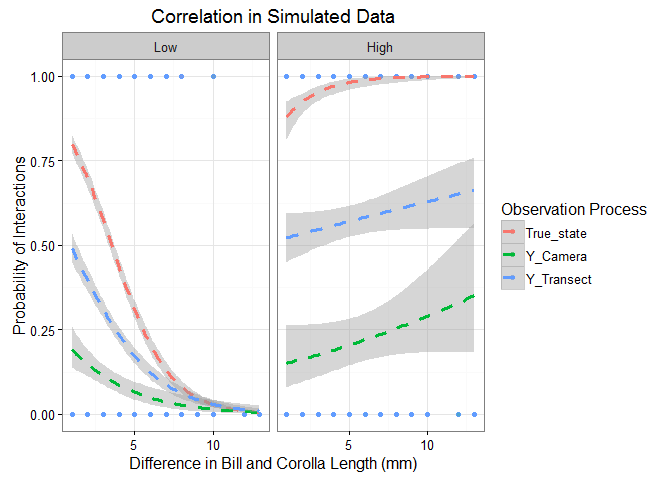
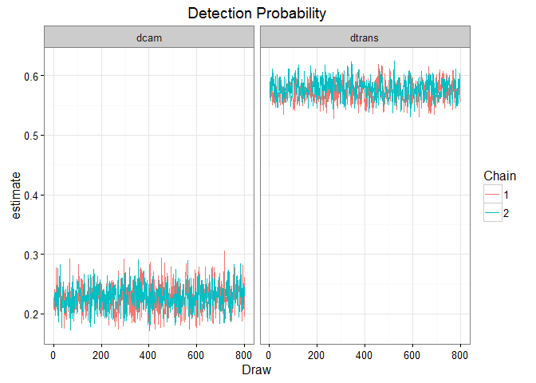
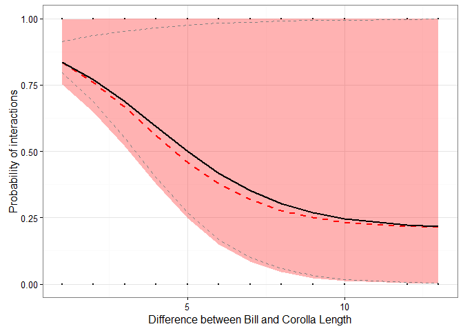

# Simulated Data for Two Detection Methods for Observing Species Interactions
Ben Weinstein  
December 25, 2015  

#Summary


There is some underlying network of interactions between hummingbird species  i and plant species j. We observe these interactions using transects across elevation ranges and cameras at individual flowers. To combine these data to jointly estimate the importance of trait-matching and resources on interaction intensity we need a hierarchical occupancy model that accounts for 1) the difference in sampling effort between survey types, 2) The variable number of replicates per species, 3) The difference in detectability of interactions based on survey type. The occupancy model below uses months as our estimated latent state. There are two surveys per month, and a variable number of cameras for each flower, often with no cameras on a given flower in a month.

# True Simulated values

Hummingbird Species =5

Plant Species=6

Survey Periods = 24

Detection Probability for Camera = 0.25

Detection Probability for Transect = 0.6


Group Intercept

* intercept<-2.5

* sigma_intercept<- 0.1

Effect of Trait-matching

* gamma1=-5

* sigma_slope1<- 0.1

Effect of Resources

* gamma2=-2

* sigma_slope2<- 0.1

Interaction effect of resources * traitmatch

* gamma3=0.3

* sigma_slope3<- 0.1

Bill sizes
Bill<-rpois(h_species,10)

Corolla sizes

Corolla<-rpois(plant_species,15)


Survey periods are 70% cameras, 30% Transect
Transects have two replicates.Cameras have variable number of replicates, modeled as rpois(lambda=0.5).

Resources are scored as either 'High' or 'Low' and is modeled as rbinom(n=1,size=1,prob=0.5)


# Observed Data



#Hierarchical Occupancy Model

For hummingbird species i feeding on plant species j observed at time k and sampling event d. 

Observation Model

Transects

$$ Y_{Transect_{i,j,k,d}} \sim Bernoulli(S_{i,j,k} * \omega_{Transect})$$
$$ \omega_{Transect} <- \phi_{Transect}* EffortTransect_k $$

Cameras

$$ Y_{Camera_{i,j,k,d}} \sim Binomial(S_{i,j,k} * \omega_{Camera})$$
$$ \omega_{Camera} <- \phi_{Camera} * EffortCamera_k $$

Process Model

$$ S_{i,j,k} \sim Binomial(\rho_{i,j,k}) $$
$$ logit(\rho_{i,j,k}) = \alpha_i + \beta_{1,i} * Traitmatch_{i,j} + \beta_{2,i} *Resources_{j,k} $$


**Priors**

$$ \phi_{Camera} \sim Uniform(0,1) $$
$$ \phi_{Transect} \sim Uniform(0,1) $$
$$\alpha_i \sim Normal(\mu_\alpha,\tau_{\alpha})$$
$$\beta_{1,i} \sim Normal(\mu_{\beta_1},\tau_{\beta_1})$$
$$\beta_{2,i} \sim Normal(\mu_{\beta_2},\tau_{\beta_2})$$

**Hyperpriors**

Group Level Means

$$\mu_{\beta_1} \sim Normal(0,0.0001)$$
$$\mu_{\beta_2} \sim Normal(0,0.0001)$$
$$ \mu_{\alpha} \sim Normal(0,0.0001)$$

Group Level Variance

$$\tau_{\alpha} \sim Gamma(0.0001,0.0001)$$
$$\tau_{\beta_1} \sim Gamma(0.0001,0.0001)$$
$$\tau_{\beta_2} \sim Gamma(0.0001,0.0001)$$

**Derived quantities**

$$\sigma_{\alpha} = \sqrt[2]{\frac{1}{\tau_\alpha}}$$
$$\sigma_{\beta_1} = \sqrt[2]{\frac{1}{\tau_{\beta_1}}}$$
$$\sigma_{\beta_2} = \sqrt[2]{\frac{1}{\tau_{\beta_2}}}$$

# Analysis of observed data


```
## 
## sink("Bayesian/NmixturePoissonRagged2m.jags")
## 
## cat("
##     model {
##     #Compute intensity for each pair of birds and plants
##     for (i in 1:Birds){
##     for (j in 1:Plants){
##     for (k in 1:Times){
##     
##     #Process Model
##     logit(rho[i,j,k])<-alpha[i] + beta1[i] * Traitmatch[i,j] + beta2[i] * resources[j,k]
##     
##     #True number of interactions
##     S[i,j,k] ~ dbern(rho[i,j,k])
##     }
##     }
##     }
## 
##     #Observed counts for each day of sampling
##     for (x in 1:Nobs){
##     
##     #Observation Process for cameras
##     detect_cam[x]<-dcam[Bird[x]] * cam_surveys[x]
## 
##     #Observation Process for transects
##     detect_transect[x]<-dtrans[Bird[x]] * trans_surveys[x]
## 
##     Yobs_camera[x] ~ dbin(detect_cam[x],S[Bird[x],Plant[x],Time[x]])    
##     Yobs_transect[x] ~ dbin(detect_transect[x],S[Bird[x],Plant[x],Time[x]])    
## 
##     #Assess Model Fit
## 
##     #Fit discrepancy statistics
##     #eval[x]<-detect[Bird[x]]*S[Bird[x],Plant[x],Camera[x]]
##     #E[x]<-pow((Yobs[x]-eval[x]),2)/(eval[x]+0.5)
##     
##     #ynew[x]~dbin(detect[Bird[x]],S[Bird[x],Plant[x],Camera[x]])
##     #E.new[x]<-pow((ynew[x]-eval[x]),2)/(eval[x]+0.5)
##     
##     }
## 
##     #Species level priors
##     
##     for (i in 1:Birds){
##     #Detect priors, logit transformed
## 
##     #For Cameras
##     logit(dcam[i]) <- dcam_logit[i]
##     dcam_logit[i] ~ dnorm(dprior_cam,tau_dcam)
## 
##     #For Transects
##     logit(dtrans[i]) <- dtrans_logit[i]
##     dtrans_logit[i] ~ dnorm(dprior_trans,tau_dtrans)
## 
##     alpha[i] ~ dnorm(intercept,tau_alpha)
##     beta1[i] ~ dnorm(gamma1,tau_beta1)    
##     beta2[i] ~ dnorm(gamma2,tau_beta2)    
##     }
## 
##     #Hyperpriors
##     #Slope grouping
##     gamma1~dnorm(0,0.0001)
##     gamma2~dnorm(0,0.0001)
##     gamma3~dnorm(0,0.0001)
##     
##     #Intercept grouping
##     intercept~dnorm(0,0.0001)
##     
##     #Detection group prior
##     dprior_cam ~ dnorm(0,0.5)
##     dprior_trans ~ dnorm(0,0.5)
## 
##     # Group intercept variance
##     tau_alpha ~ dgamma(0.0001,0.0001)
##     sigma_alpha<-pow(1/tau_alpha,2) 
##     
##     #Group effect detect camera
##     tau_dcam ~ dunif(0,10)
##     sigma_dcam<-pow(1/tau_dcam,.5)
##     
##     #Group effect detect camera
##     tau_dtrans ~ dunif(0,10)
##     sigma_dtrans<-pow(1/tau_dtrans,.5)
## 
##     #Group Effect of traits
##     tau_beta1 ~ dgamma(0.0001,0.0001)
##     sigma_slope1<-pow(1/tau_beta1,.5)
##     
##     #Group Effect of Resources
##     tau_beta2 ~ dgamma(0.0001,0.0001)
##     sigma_slope2<-pow(1/tau_beta2,.5)
## 
## }
##     ",fill=TRUE)
## 
## sink()
```


###Assess Convergence





###Posteriors


###Predicted Relationship 


#Predicted Relationship



The true data is plotted overtop the simulation relationship in black, and the predicted relationship in dashed red with pink CI intervals.

#Predicted Networks

Generate a binary network from the model. Given the uncertainty, this analysis will be done many times to calculate network metrics. 

##
Function to create a network from posteriors.

## Trait Model


## Abundance Model

Just for month #1.


# Compare Networks


# Consensus Network

* Highlight Trait links as red
* Highlgiht Abundance links as blue
* Highlgiht joint links as purple
* Highlight Missed links as black


